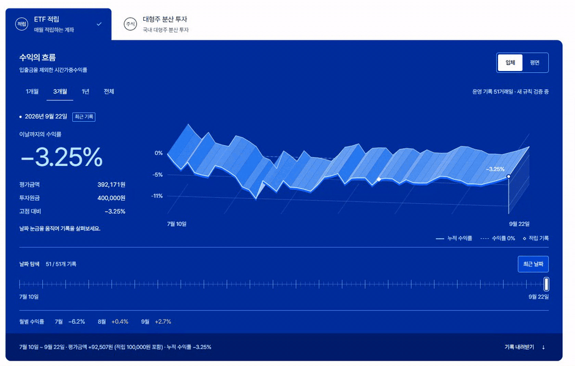
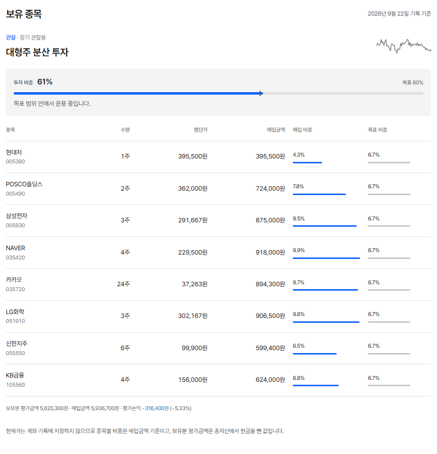
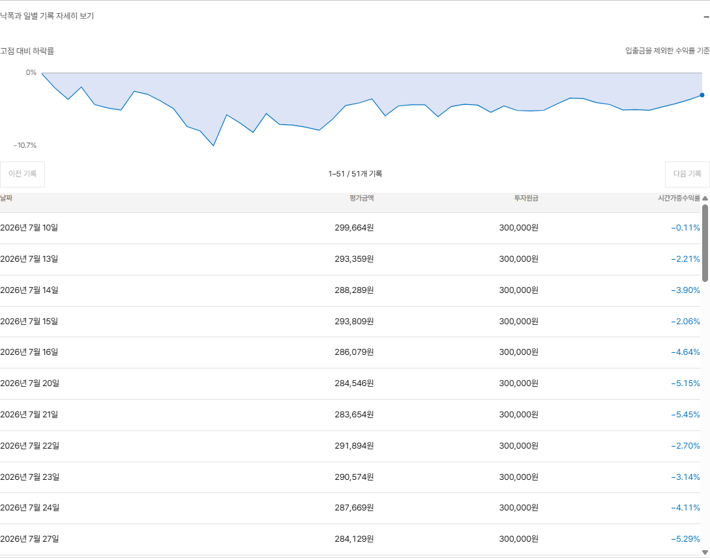
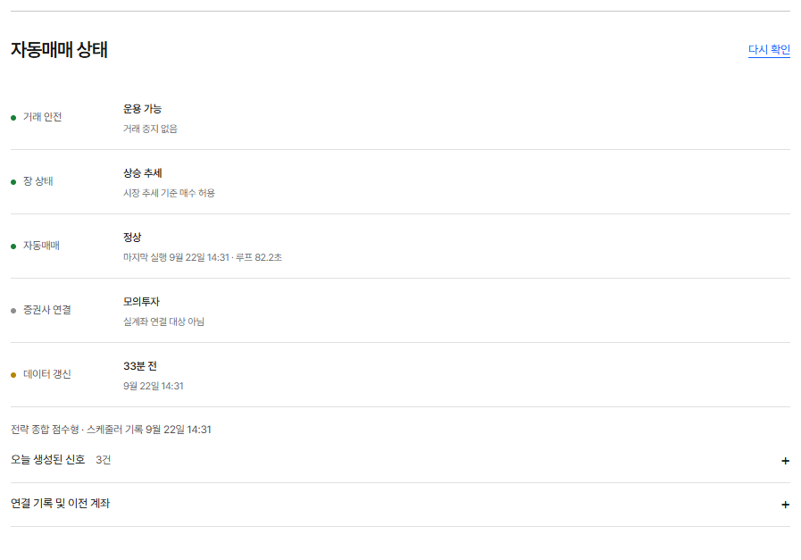
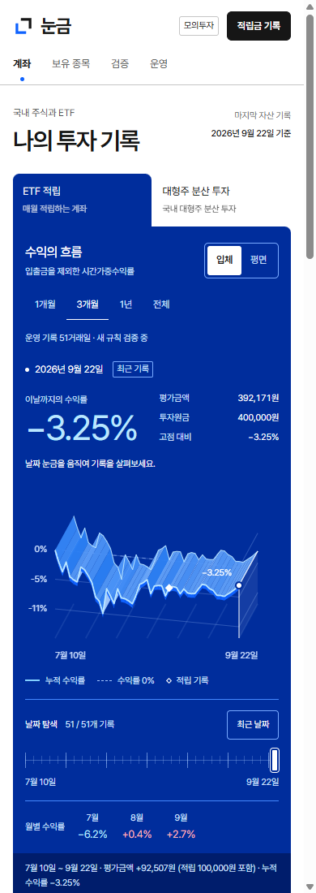

[한국어](README.md) · [English](README.en.md) · **日本語** · [简体中文](README.zh-CN.md)

# Nungum（눈금）

**自分のPCで動かす、韓国株・ETFの自動売買ツール**

銘柄と目標の配分比率を設定し、仮想資金で売買を試せます。運用成績や保有銘柄、自動売買の稼働状況はブラウザから確認できます。過去の株価を使ったバックテストにも対応しています。

[インストール](docs/ja/GETTING_STARTED.md) · [画面の使い方](docs/ja/GETTING_STARTED.md#画面の使い方) · [バックテスト](#バックテスト) · [不具合報告・機能の提案](https://github.com/easygap/quant_trader/issues/new/choose)

この説明は日本語ですが、**アプリの画面は現在、韓国語のみ**です。金額は韓国ウォン（KRW）、日時は韓国標準時（UTC+9）で表示します。操作ガイドには、画面に表示される韓国語のボタン名も記載しています。

## 口座と運用成績

このページの画像はすべて、2026年9月22日に撮影したデモ取引の画面です。[静止画で見る](docs/images/readme-account-20260922.png)

投資元本、評価額、月別リターンをまとめて確認できます。追加入金は利益に含めません。期間や日付を選んで、口座の推移を振り返れます。

## 保有銘柄

保有数量や平均取得単価に加え、現在の配分比率と目標比率を比較できます。表の比率は**取得金額ベース**です。時価による評価額と評価損益は、表の下に表示します。

## 日別データとCSV出力

日別データは表で確認でき、CSVで保存してExcelなどでも使えます。画面では100件ずつ表示し、CSVには選択した期間の全件を出力します。

## 自動売買の設定

| 初期設定                                         | 内容                                                                                   |
| ------------------------------------------------ | -------------------------------------------------------------------------------------- |
| **ETF積立**（`ETF 적립`）                        | KODEX 200と、韓国のCD金利に連動するTIGER ETFに分散投資します。現在はデモ取引専用です。 |
| **韓国大型株への分散投資**（`대형주 분산 투자`） | 韓国大型株と現金を保有し、目標比率からのずれが大きくなると配分を調整します。           |

銘柄や配分比率は変更できます。[設定方法とデモ取引の手順](docs/ja/GETTING_STARTED.md#デモ取引)

発注前に残高や取引制限を確認します。稼働状況の画面では、前回の実行時刻や取引を停止した理由を確認できます。

自動売買の稼働状況

スマートフォンでの表示

初期設定では、起動したPCからのみアクセスできます。スマートフォンから接続するには[別途設定が必要です](docs/ja/GETTING_STARTED.md#別の端末からのアクセス)。

## インストール

**Python 3.11または3.12とGit**が必要です。手順はWindows PowerShellを使う場合のものです。

1. [インストールガイド](docs/ja/GETTING_STARTED.md)に沿って準備します。
2. 同じPCで[口座画面](http://127.0.0.1:8080)を開きます。
3. 発注内容を確認してから、[デモ取引](docs/ja/GETTING_STARTED.md#デモ取引)を実行します。

インストール直後は、まだ取引履歴がありません。

口座画面と自動売買は別々に起動します。画面を開くだけでは売買は始まりません。継続して自動売買を行うには、PCと売買プログラムを起動しておく必要があります。実際の口座での取引には、**韓国投資証券（Korea Investment & Securities）のKIS Open API**を使います。[実口座の設定手順](docs/PAPER_TO_LIVE_RUNBOOK.md)は現在、韓国語で提供しています。

## バックテスト

過去の株価に売買ルールを適用し、リターンや最大下落率を比較できます。手数料などの取引コストを含む結果と、計算の前提条件を公開しています。

[実行方法](docs/ja/GETTING_STARTED.md#バックテスト) · [比較結果（韓国語）](docs/RISK_REVIEW_20260922.md) · [発注数量と取引コストの比較（韓国語）](docs/REBALANCE_REVIEW_20260922.md)

デモ取引やバックテストの結果は、実際の利益を保証するものではありません。CD金利連動ETFも元本保証ではありません。

## お問い合わせ

不具合や機能の提案は[GitHubのIssue](https://github.com/easygap/quant_trader/issues/new/choose)へお寄せください。画像やログを添付する際は、口座番号やAPIキーを削除してください。

設定ファイルとソースコード

[コード構成・定期実行の設定（韓国語）](docs/PROJECT_GUIDE.md) · [取引の停止条件（韓国語）](docs/SAFETY_MODEL.md)

Python、aiohttp、SQLite、HTML/CSS/JavaScriptを使用しています。

