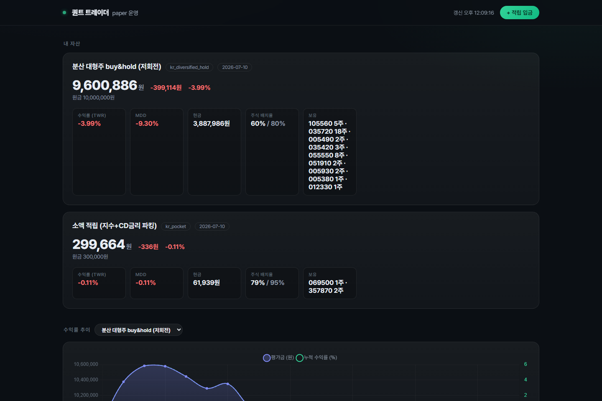
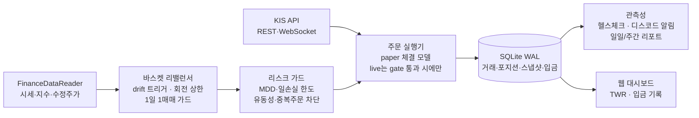
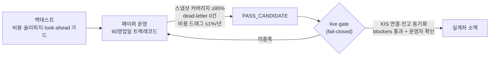

# QUANT TRADER


한국 주식 자동매매를 **백테스트 → 페이퍼 트레이딩 → 실전 게이트**까지 한 저장소에서 굴리는 개인 프로젝트입니다.
데이터 수집, 전략 검증, 리스크 관리, 일일 자동 운영, 웹 대시보드, KIS API 연동까지 전부 재현 가능하게 구성했습니다.

이 프로젝트가 다른 자동매매 저장소와 다른 점은 **결론이 정직하다는 것**입니다.

- 능동 알파(시장 예측으로 초과수익)를 candidate family 단위로 수개월 체계적으로 탐색했고, 전부 승격 게이트를 넘지 못했습니다. 그 실패 기록 전체를 [연구 로그](docs/RESEARCH_LOG.md)로 남겼습니다.
- 그래서 수익은 예측이 아니라 **구조**에서 얻습니다 — 분산 베타 보유 + 유휴 현금의 이자 회수 + 비용 최소화(ETF 매도세 면제 반영) + 월 적립 복리.
- 안전이 항상 우선입니다. 실전 주문 경로는 여러 단계의 **fail-closed 게이트**를 전부 통과해야만 열립니다.

> 학습·연구용 프로젝트입니다. 투자 조언이 아닙니다.

## 운영 대시보드



*실제 운영 화면 (2026-07-10). 트랙별 평가금·TWR 수익률·MDD·주식 배치율·보유 종목을 한눈에 보고, 월 적립 입금도 우측 상단 버튼으로 기록합니다. 입금은 시간가중수익률(TWR)로 중화되어 수익률을 왜곡하지 않습니다.*

```bash
python main.py --mode dashboard   # http://127.0.0.1:8080
```

## 시스템 구성



체결 반영은 원장 정합성을 보장합니다 — 포지션 저장이 실패하면 방금 저장한 매매 기록을 보상 롤백해 "현금만 차감된 반쪽 원장"이 남지 않고, 예외성 주문 실패는 디스코드 critical로 즉시 승격됩니다.

## 운영 트랙 (2026-07-10 기준)

| 트랙 | 구성 | 자본 | 진행 |
|------|------|------|------|
| **소액 적립** `kr_pocket` | KODEX 200 47.5% + CD금리 파킹 ETF 47.5% + 현금 5% | 30만 시작 + 월 10만 적립 | 페이퍼 1/60일 |
| **분산 대형주** `kr_diversified_hold` | 대형주 10종목 균등 buy&hold (저회전) | 1,000만 (페이퍼) | 23/60일 · 관찰용 |
| 단타 샌드박스 | 페이퍼 전용 (실돈 투입은 60일 게이트 통과 후 별도 결정) | — | 대기 |

소액 트랙이 핵심입니다. 예측 없이 얻을 수 있는 것만 조합했습니다:

- **지수 절반**: KODEX 200 1주가 그 자체로 200종목 분산 — 소액에서 유일한 분산 수단
- **파킹 절반**: 유휴 현금을 CD금리 누적형 ETF로 — 시장 위험 없이 연 3%대, 종전 "이자 0 현금"의 캐시 드래그 제거
- **비용 정합**: 국내 상장 ETF 매도 거래세 면제를 체결 모델에도 반영 — 가짜 비용으로 승격 판정이 왜곡되지 않게
- 낙폭에 민감한 설계: 위험자산을 총자산의 절반으로 고정해 MDD를 주식 100% 대비 절반 수준으로 억제

## 페이퍼 → 실전 승격 파이프라인



실계좌는 페이퍼 트랙레코드가 기준을 통과하기 전에는 **어떤 조합으로도 열리지 않습니다**. `--force-live` 같은 우회 플래그는 제거했습니다.

## 일일 운영 (자동)

매 영업일 오전 10시에 한 사이클이 자동으로 돕니다:

```
리밸런싱 판단 → (필요 시) 주문 → NAV 스냅샷 → DB 백업 → 승격 진행률 리포트 → 디스코드 카드
```

- 스냅샷 결측은 당일 critical 경보 (KST 기준 영업일 판정)
- 금요일에는 백업 **복구 리허설**까지 자동 수행 — 백업이 실제로 복구되는지 매주 검증
- 운영자 점검은 명령 하나면 됩니다:

```bash
python main.py --mode health
# 종료코드 0=OK / 1=ATTENTION / 2=BLOCKED — 모니터링 스크립트에서 분기 가능
# 승격 대기 같은 파이프라인의 '예상 상태'는 라벨로만 표시하고 경보로 올리지 않는다
# — 매일 노란불이면 진짜 장애를 못 알아본다
```

## Quick Start

```bash
python -m venv .venv
.venv\Scripts\activate
pip install -r requirements.txt

# 설정: config/settings.yaml.example → settings.yaml, .env.example → .env
# 디스코드 알림을 쓰려면 .env의 DISCORD_WEBHOOK_URL 설정

python main.py --mode guide                                    # 실행 모드 안내
python main.py --mode backtest --strategy scoring --symbol 005930
python main.py --mode rebalance --dry-run                      # 바스켓 리밸런싱 (계획만)
python main.py --mode health                                   # 운영 통합 헬스 점검
python main.py --mode weekly_report                            # 주간 요약 (성과·귀속 분해)
python main.py --mode dashboard                                # 웹 대시보드
pytest tests/ -q                                               # 테스트 1,683개
```

월 적립 기록은 대시보드의 **적립 입금** 버튼이 제일 편하고, CLI도 있습니다:

```bash
python tools/record_deposit.py --basket kr_pocket --amount 100000
```

## 안전장치

실전 경험(과 사고)에서 나온 것들이라 목록이 깁니다. 설계 원칙은 세 가지입니다.

1. **fail-closed** — 데이터 조회 실패, 상태 불명, 검증 불가면 주문하지 않는다
2. **원장 정합** — 거래·포지션·현금이 어긋난 반쪽 상태를 남기지 않는다 (보상 롤백)
3. **경보 위생** — 파이프라인의 예상 상태는 라벨, 진짜 장애만 경보 (매일 울리는 경보는 없는 것과 같다)

<details>
<summary><b>세부 안전장치 목록 펼치기</b></summary>

- 포트폴리오 MDD·일손실 한도 도달 시 신규 매수 차단 (손절·청산 SELL은 유지)
- 미체결/중복 주문 방지 — live 미체결 조회 실패는 "미체결 있음"으로 간주 (fail-closed)
- 신규 매수 직전 유동성(평균 거래량·거래대금) 재검증, 누락 시 차단
- 갭 리스크·상관관계·업종 비중 확인용 데이터 조회 실패 시 신규 매수 차단
- 주문/청산 판단 가격이 0·NaN·누락이면 판단 보류 + 차단 이벤트 기록
- 시장 국면 필터 데이터 불명 시 `unknown` 국면으로 신규 매수 차단
- live 체결 확인 전 DB 반영 보류, 주문번호 불일치 시 반영 보류
- live 시작 전 KIS 연결·잔고 동기화 실패 시 스케줄러 시작 차단
- 체결 반영 원자성: 포지션 저장 실패 시 매매 기록 보상 롤백 (반쪽 원장 방지)
- 예외성 주문 실패는 ORDER_ERROR critical 이벤트 + 디스코드 즉시 알림
- 1일 1매매 가드 — 중복 사이클이 회전 상한을 우회하지 못하게
- 스키마 마이그레이션은 멱등·중단 재개 가능, 행수 검증 실패 시 원본 보존
- DB 백업 (보존 14일) + 매주 금요일 복구 리허설 자동 수행
- 웹 대시보드 쓰기는 입금 기록 하나뿐 (매매·설정 변경 불가), CSRF 방어 적용
- 긴급 청산은 POST 전용 · 127.0.0.1 바인드 · 토큰 검증 기본 적용

</details>

세부 파라미터는 `config/risk_params.yaml`, `config/baskets.yaml`에서 관리합니다.

## 프로젝트 구조

```
quant_trader/
├── main.py               # 모드 라우터 (backtest/rebalance/health/dashboard/...)
├── config/               # 설정 (baskets, risk_params, strategies, settings)
├── core/                 # 리밸런서·리스크·주문 실행·헬스·관측성·paper 런타임
├── strategies/           # 전략 (scoring, rotation 등 — 현재 전부 연구 보관)
├── backtest/             # 백테스터 (비용·슬리피지·이벤트 가드 반영)
├── database/             # SQLite 모델·리포지토리·마이그레이션·백업
├── monitoring/           # 로깅·디스코드·웹 대시보드
├── api/                  # KIS REST·WebSocket
├── tools/                # 운영 도구 (입금 기록·평가·트랙 재시작·시뮬레이터)
├── scripts/              # 검증 스크립트 (OOS·sleeve 비교·리포트)
├── deploy/               # (선택) Oracle Cloud ARM 상시 구동 (systemd)
├── tests/                # 1,683개 (외부 API는 모킹, DB는 격리)
└── docs/                 # 설계·운영 문서 (+ images/ 스크린샷)
```

## 문서

| 문서 | 내용 |
|------|------|
| [PROFITABILITY_FINDINGS](docs/PROFITABILITY_FINDINGS.md) | **수익성 정직 점검 (먼저 읽을 것)** — 알파 탐색 결론 |
| [POCKET_TRACK_PLAN](docs/POCKET_TRACK_PLAN.md) | 소액 적립 트랙 설계 — 기대치·구성·입금·게이트 |
| [BASKET_PAPER_EVALUATION](docs/BASKET_PAPER_EVALUATION.md) | 페이퍼→실전 승격 기준과 자동 판정 |
| [BASKET_LIVE_RUNBOOK](docs/BASKET_LIVE_RUNBOOK.md) | 실전 전환 절차 (모의서버 리허설 → 소액 → 목표 자본) |
| [PROJECT_GUIDE](docs/PROJECT_GUIDE.md) | 파일 역할·모드별 흐름·실전 전 체크리스트 |
| [RESEARCH_LOG](docs/RESEARCH_LOG.md) | 연구·운영 상세 이력 아카이브 (알파 탐색 실패 기록 포함) |
| [quant_trader_design](quant_trader_design.md) | 아키텍처·전략·리스크 설계 |

## English Summary

`quant_trader` is a risk-first algorithmic trading project for Korean equities: backtesting, paper trading with a 60-trading-day promotion track record, KIS API integration, TWR-based deposit accounting, and live-trading gates that fail closed. After months of systematic alpha research concluded honestly in "no edge at this scale", the deployed strategy is structural: diversified beta + parking idle cash in a CD-rate ETF + cost minimization + monthly contributions.
