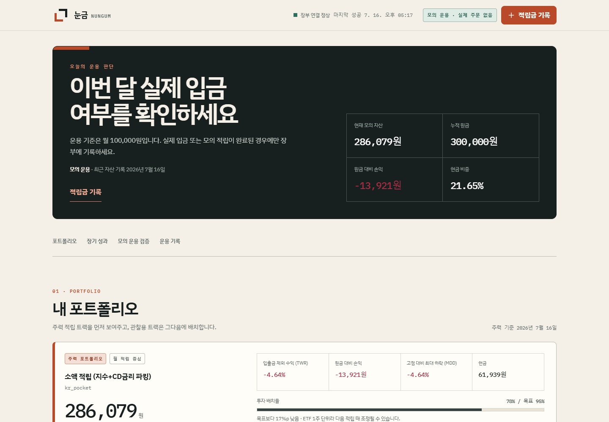
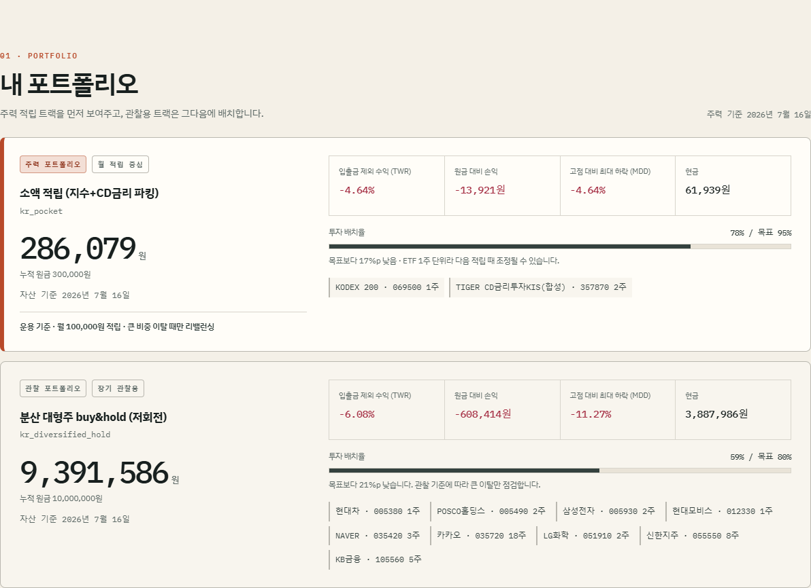
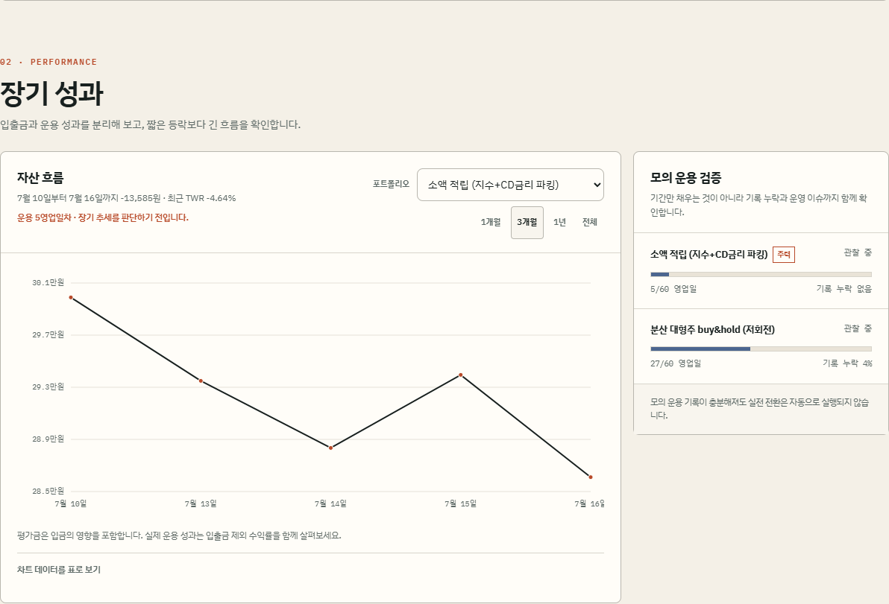
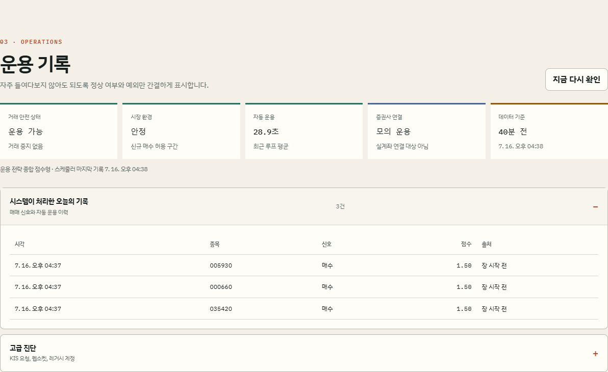
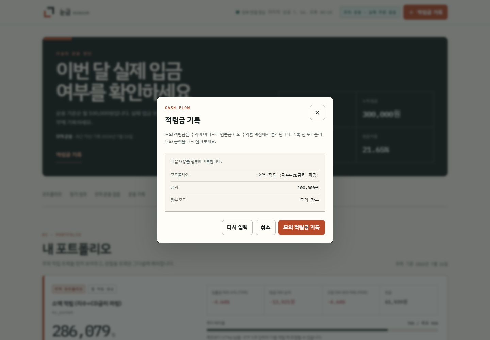

# 눈금 NUNGUM

**오래 투자하기 위한 기준과 기록.**

오래 투자하려면 오늘 무엇을 해야 하고, 무엇을 그냥 두어야 하는지부터 분명해야 합니다.

눈금은 한국 주식 포트폴리오를 모의 운용하며 자산 흐름, 적립 내역, 시스템 상태를 한 화면에서 살펴보는 로컬 대시보드입니다. 매일 시세를 쫓기보다 정한 기준을 지키고 기록을 쌓는 데 초점을 맞췄습니다.

> 기본 설정은 모의 운용입니다. 실제 주문은 필요한 안전 조건을 확인하고 사용자가 직접 활성화하기 전에는 실행되지 않습니다. 수익과 원금은 보장하지 않습니다.



## 화면 둘러보기

### 오늘 볼 일만 먼저

적립 여부, 오래된 데이터, 거래 중지처럼 지금 살펴봐야 할 항목 하나를 첫 화면에 보여줍니다. 별일이 없으면 `오늘은 할 일이 없습니다`라고 알려줍니다.

### 포트폴리오를 한눈에



주력 포트폴리오와 관찰용 포트폴리오를 나눠 보여줍니다. 현재 자산, 누적 원금, 입출금 제외 수익률(TWR), 최대 낙폭(MDD), 현금과 보유 종목을 한곳에서 볼 수 있습니다.

### 짧은 등락보다 긴 흐름



포트폴리오와 기간을 바꿔 자산 흐름을 살펴볼 수 있습니다. 운용 기록이 아직 짧다면 성과를 서둘러 판단하지 않도록 기록 일수와 누락 여부도 함께 표시합니다.

### 문제가 생겼을 때만 자세히



평소에는 거래 안전 상태, 시장 환경, 자동 운용과 데이터 시각만 간단히 보여줍니다. 필요할 때만 오늘의 처리 기록과 고급 진단을 펼쳐볼 수 있고, 거래가 멈추면 원인과 복구 순서를 따로 안내합니다.

### 넣은 돈은 수익과 따로



적립금은 포트폴리오와 금액, 장부 모드를 마지막에 한 번 더 확인한 뒤 기록합니다. 입금으로 늘어난 금액이 투자 수익처럼 보이지 않도록 운용 성과와 분리해 계산합니다.

## 실행하기

Python 3.11 또는 3.12가 필요합니다.

```bash
git clone https://github.com/easygap/quant_trader.git
cd quant_trader

python -m venv .venv
# Windows PowerShell
.venv\Scripts\Activate.ps1
# macOS/Linux: source .venv/bin/activate

pip install -r requirements.txt
cp config/settings.yaml.example config/settings.yaml
cp .env.example .env
python main.py --mode dashboard
```

기본 바인드는 http://127.0.0.1:8080입니다. 브라우저에서 이 주소를 열면 됩니다. 대시보드는 인증 없이 금융 정보를 다루므로 현재 PC에서만 접속할 수 있습니다.

처음 시작해 화면에 운용 기록이 없다면 모의 운용을 한 번 실행하세요.

```bash
python main.py --mode paper
```

KIS 모의투자나 알림을 사용할 때만 `.env`에 필요한 값을 채웁니다. `.env`와 실제 계좌 정보는 Git에 올리지 마세요.

## 처음이라면 이렇게 보세요

1. 화면 위쪽에서 오늘 살펴볼 일을 봅니다.
2. 주력 포트폴리오의 자산과 현금 비중을 살펴봅니다.
3. 장기 성과에서 자산 흐름이 어떻게 이어지고 있는지 봅니다.
4. 실제로 넣은 금액이 있다면 **적립금 기록**에 남깁니다.
5. 모의 운용 기록이 충분히 쌓이기 전에는 실전 주문을 사용하지 않습니다.

## 실제 주문 전에

처음 내려받은 설정은 아래 상태입니다.

```yaml
kis_api:
  use_mock: true
trading:
  mode: "paper"
  auto_entry: false
```

가격, 잔고나 체결 상태가 불확실하면 새 주문을 차단합니다. 부분 체결이나 장부 저장 실패처럼 직접 점검이 필요한 상황에서는 거래를 멈추고 화면에 이유를 남깁니다. 어떤 안전장치도 시장 급변, 슬리피지, API 장애나 투자 손실을 완전히 없앨 수는 없습니다.

## 더 자세히

- [사용·운영 가이드](docs/PROJECT_GUIDE.md)
- [안전 장치와 복구 순서](docs/SAFETY_MODEL.md)
- [소액 적립 포트폴리오 설계](docs/POCKET_TRACK_PLAN.md)
- [연구 결과와 한계](docs/PROFITABILITY_FINDINGS.md)

이 프로젝트는 개인 연구와 모의 운용을 위한 도구이며 투자 조언이 아닙니다. 실제 자금을 사용하기 전에는 코드와 설정, 증권사 규정, 세금 조건을 직접 검토하세요.
