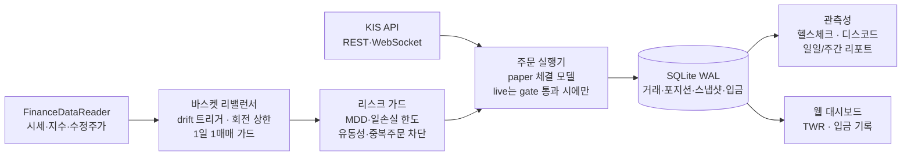
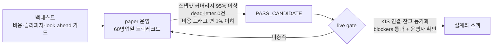

# QUANT TRADER


한국 주식 자동매매 개인 프로젝트. 데이터 수집부터 백테스트, 모의투자(paper), 리스크 관리,
일일 자동 운영, 웹 대시보드, KIS API 연동까지 한 저장소에서 돌린다.

처음엔 단타 알파를 찾는 게 목표였다. 몇 달 동안 후보군을 바꿔가며 체계적으로 돌려봤고,
결론은 "내 규모에서 시장 예측으로 초과수익은 안 나온다"였다. 그 실패 기록은 지우지 않고
[연구 로그](docs/RESEARCH_LOG.md)에 전부 남겨뒀다. 지금은 방향을 바꿔서 예측 없이 먹을 수
있는 것만 조합해 굴리는 중이다. 지수 ETF 분산 + 유휴 현금은 CD금리 파킹 + 거래비용 최소화
+ 월 적립. 대신 실전 주문 경로는 검증을 통과하기 전까지 전부 막아뒀다(fail-closed).

> 학습용 프로젝트고 투자 조언이 아님.

## 운영 화면


운영 대시보드 (2026-07-10 캡처). 트랙별 평가금, 수익률(TWR), MDD, 주식 배치율, 보유 종목을
한 화면에서 본다. 월 적립은 우측 상단 버튼으로 기록하는데, 입금은 시간가중수익률로 중화돼서
수익률이 왜곡되지 않는다. 대시보드에서 할 수 있는 쓰기 작업은 입금 기록 하나뿐이고
매매나 설정 변경은 못 한다.

```bash
python main.py --mode dashboard   # http://127.0.0.1:8080
```

## 지금 굴리는 트랙 (2026-07-10 기준)

| 트랙 | 구성 | 자본 | 진행 |
|------|------|------|------|
| `kr_pocket` 소액 적립 | KODEX 200 47.5% + CD금리 파킹 ETF 47.5% + 현금 5% | 30만 시작, 월 10만 적립 | paper 1/60일 |
| `kr_diversified_hold` | 대형주 10종목 균등 buy&hold, 저회전 | 1,000만 (paper) | 23/60일, 관찰용 |
| 단타 샌드박스 | paper 전용. 실돈은 60일 게이트 통과 후 따로 결정 | - | 대기 |

실제로 돈이 들어갈 트랙은 `kr_pocket` 하나다.

- KODEX 200 1주면 그 자체로 200종목 분산이라 소액에서 유일하게 말이 되는 분산 수단
- 나머지 절반을 그냥 현금으로 두면 이자 0이라, CD금리 누적형 ETF에 파킹 (연 3%대, 가격 변동 사실상 없음)
- 국내 상장 ETF는 매도 거래세 면제. 이걸 체결 비용 모델에도 반영해서 페이퍼 성적이 가짜 비용으로 깎이지 않게 함
- 위험자산을 총자산의 절반으로 고정. 백테스트 기준 MDD가 주식 100% 대비 절반 수준

## 시스템 구성



## paper → 실전 승격



paper 트랙레코드가 기준을 못 넘으면 실계좌는 안 열린다. 예전에 있던 `--force-live` 같은
우회 플래그는 지웠다.

## 일일 운영

평일 오전 10시에 한 사이클이 자동으로 돈다.

```
리밸런싱 판단 → (필요 시) 주문 → NAV 스냅샷 → DB 백업 → 승격 진행률 → 디스코드 카드
```

- 당일 스냅샷이 빠지면 critical 경보 (영업일 판정은 KST 기준)
- 금요일엔 백업 복구 리허설까지 돈다. 백업 파일이 실제로 복구되는지 매주 확인하는 용도
- 평소 점검은 이거 하나로 끝:

```bash
python main.py --mode health
# 종료코드 0=OK / 1=ATTENTION / 2=BLOCKED
# 승격 대기 같은 '원래 그런 상태'는 라벨로만 찍히고 경보로 안 올라온다
```

## 시작하기

```bash
python -m venv .venv
.venv\Scripts\activate
pip install -r requirements.txt

# config/settings.yaml.example → settings.yaml 복사, .env.example 참고해서 .env 작성
# 디스코드 알림 쓰려면 .env에 DISCORD_WEBHOOK_URL 필요

python main.py --mode guide                                    # 실행 모드 목록
python main.py --mode backtest --strategy scoring --symbol 005930
python main.py --mode rebalance --dry-run                      # 리밸런싱 계획만 확인
python main.py --mode health                                   # 운영 점검
python main.py --mode weekly_report                            # 주간 요약
pytest tests/ -q
```

월 적립 기록은 대시보드 버튼이 편하고, CLI도 있다.

```bash
python tools/record_deposit.py --basket kr_pocket --amount 100000
```

## 안전장치

한 번씩 데인 뒤에 추가된 것들이라 목록이 길다. 기본 방침은 이렇다.

- 데이터 조회 실패, 상태 불명, 검증 불가면 주문 안 한다 (fail-closed)
- 거래·포지션·현금이 어긋난 반쪽 원장을 남기지 않는다. 포지션 저장이 실패하면 방금 쓴 매매 기록을 되돌리고 실패를 위로 올린다
- 파이프라인상 원래 그런 상태는 라벨, 진짜 장애만 경보. 매일 울리는 경보는 결국 아무도 안 본다

<details>
<summary>세부 목록 펼치기</summary>

- 포트폴리오 MDD·일손실 한도 도달 시 신규 매수 차단 (손절·청산 SELL은 유지)
- 미체결/중복 주문 방지. live 미체결 조회가 실패하면 "미체결 있음"으로 간주
- 신규 매수 직전 유동성(평균 거래량·거래대금) 재검증, 누락 시 차단
- 갭 리스크·상관관계·업종 비중 확인용 데이터 조회 실패 시 신규 매수 차단
- 주문/청산 판단 가격이 0, NaN, 누락이면 판단 보류 + 차단 이벤트 기록
- 시장 국면 필터 데이터 불명 시 unknown 국면으로 신규 매수 차단
- live 체결 확인 전 DB 반영 보류, 주문번호 불일치 시에도 보류
- live 시작 전 KIS 연결·잔고 동기화 실패 시 스케줄러 시작 차단
- 주문 예외성 실패는 ORDER_ERROR critical 이벤트 + 디스코드 즉시 알림
- 1일 1매매 가드. 사이클이 중복 실행돼도 회전 상한을 우회하지 못함
- 스키마 마이그레이션은 멱등, 중단 지점부터 재개 가능, 행수 검증 실패 시 원본 보존
- DB 백업 보존 14일 + 매주 금요일 복구 리허설
- 대시보드 쓰기는 입금 기록 하나뿐, CSRF 방어 적용
- 긴급 청산은 POST 전용, 127.0.0.1 바인드, 토큰 검증 기본 적용

</details>

파라미터는 `config/risk_params.yaml`, `config/baskets.yaml`에서 관리.

## 폴더 구조

```
quant_trader/
├── main.py               # 모드 라우터 (backtest/rebalance/health/dashboard/...)
├── config/               # 설정 (baskets, risk_params, strategies, settings)
├── core/                 # 리밸런서, 리스크, 주문 실행, 헬스, 관측성, paper 런타임
├── strategies/           # 전략들 (현재 전부 연구 보관 상태)
├── backtest/             # 백테스터 (비용·슬리피지·이벤트 가드 반영)
├── database/             # SQLite 모델, 리포지토리, 마이그레이션, 백업
├── monitoring/           # 로깅, 디스코드, 웹 대시보드
├── api/                  # KIS REST·WebSocket
├── tools/                # 운영 도구 (입금 기록, 평가, 트랙 재시작, 시뮬레이터)
├── scripts/              # 검증 스크립트
├── deploy/               # (선택) Oracle Cloud ARM 상시 구동
├── tests/                # 외부 API는 모킹, DB는 격리
└── docs/                 # 문서, 스크린샷
```

## 문서

| 문서 | 내용 |
|------|------|
| [PROFITABILITY_FINDINGS](docs/PROFITABILITY_FINDINGS.md) | 수익성 점검 결론. 뭘 시도했고 왜 접었는지 |
| [POCKET_TRACK_PLAN](docs/POCKET_TRACK_PLAN.md) | 소액 적립 트랙 설계. 기대치, 구성, 입금, 게이트 |
| [BASKET_PAPER_EVALUATION](docs/BASKET_PAPER_EVALUATION.md) | paper→실전 승격 기준과 자동 판정 |
| [BASKET_LIVE_RUNBOOK](docs/BASKET_LIVE_RUNBOOK.md) | 실전 전환 절차 (모의서버 리허설 → 소액 → 목표 자본) |
| [PROJECT_GUIDE](docs/PROJECT_GUIDE.md) | 파일 역할, 모드별 흐름, 실전 전 체크리스트 |
| [RESEARCH_LOG](docs/RESEARCH_LOG.md) | 연구·운영 이력 아카이브. 알파 탐색 실패 기록 포함 |
| [quant_trader_design](quant_trader_design.md) | 아키텍처, 전략, 리스크 설계 |
