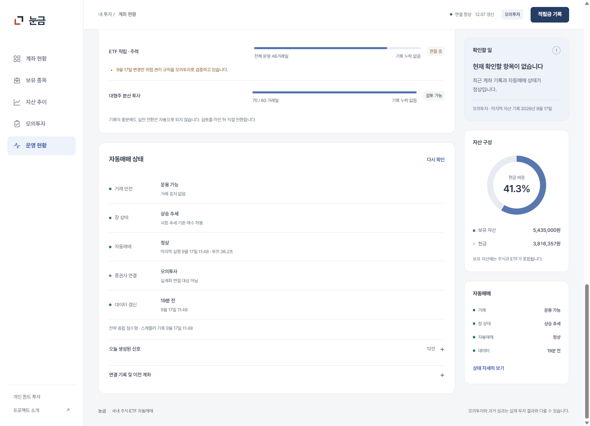
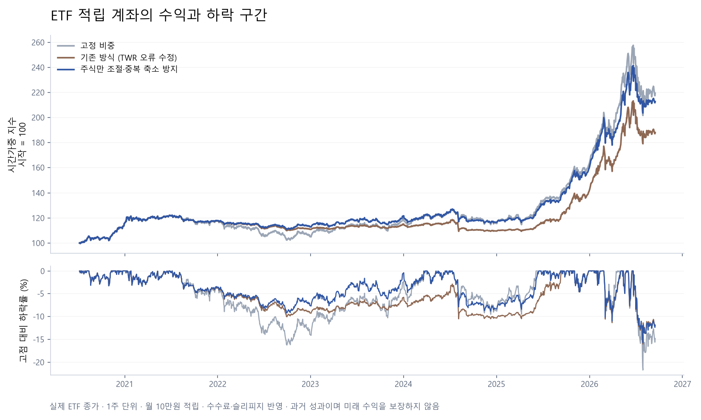

# 눈금

**국내 주식·ETF 자동매매와 계좌 관리**

정해 둔 비중에 맞춰 주식과 ETF를 사고팔고, 원금·수익률·보유 종목을 한 화면에서 확인하는 개인용 투자 도구입니다. 과거 데이터로 운용 규칙을 비교하고, 모의투자로 실제 동작을 점검할 수 있습니다.


*2026년 9월 17일 모의투자 기록을 불러온 실제 화면입니다. 아래 백테스트와는 별도의 계좌 기록입니다.*

## 할 수 있는 일

- **계좌 확인** — 총자산, 투자원금, 현금, 보유 종목과 목표 비중을 확인합니다.
- **성과 확인** — 적립금을 수익에서 제외한 수익률, 자산 추이, 고점 대비 하락률을 봅니다.
- **자동 리밸런싱** — 실제 비중이 설정 범위를 벗어나면 조정합니다. 최소 주문금액과 1주 단위를 반영합니다.
- **모의투자 검증** — 운영 기록, 누락된 자산 기록, 거래비용과 미해결 주문을 확인합니다.
- **운영 점검** — 자동매매 실행 여부, 거래 중지 상태, 증권사 연결과 데이터 갱신 상태를 봅니다.

Python·aiohttp·SQLite·한국투자증권 KIS API를 사용합니다. 화면은 HTML/CSS/JavaScript로 만들었으며 프런트엔드 설치나 빌드 과정이 없습니다.

## 화면

### 보유 종목과 비중

매입금액과 목표 비중을 나란히 보여 줍니다. 계좌를 바꾸면 요약, 종목표, 차트, 적립금 입력 대상이 함께 바뀝니다.


### 모바일과 운영 상태

작은 화면에서도 잔액과 수익률을 먼저 보여 줍니다. 적립금은 계좌·금액·모의/실전 구분을 확인한 뒤 기록합니다. 모의투자 적립은 가상 계좌에만 반영됩니다.

<details>
<summary>모바일 화면 보기</summary>


</details>

<details>
<summary>자동매매 상태 화면 보기</summary>



</details>

## 기본 운용 구성

| 계좌 | 구성과 역할 | 현재 상태 |
|---|---|---|
| ETF 적립 | KODEX 200 + TIGER CD금리 ETF. 시작 30만원, 매월 10만원 적립 | 변경한 위험 관리 규칙을 모의투자로 검증 중 |
| 대형주 분산 투자 | 국내 대형주 9종목. 주식 60%·현금 40%, 큰 비중 이탈 시 조정 | 기존 규칙으로 모의투자 운용 |

ETF 적립의 기본 목표는 주식 ETF 47.5%·CD금리 ETF 47.5%·현금 5%입니다. 방어 조건에 들어가면 주식 ETF 목표를 23.75%로 낮추고, 줄인 만큼을 CD금리 ETF에 배분합니다. 소액 계좌는 1주 가격과 최소 주문금액 때문에 실제 비중이 목표와 다를 수 있습니다. CD금리 ETF도 원금 보장 상품은 아닙니다.

설정은 [config/baskets.yaml](config/baskets.yaml)에 있습니다. 실전 주문에는 별도의 활성화와 검증이 필요하며, ETF 적립 계좌는 `paper_only: true`로 실전 전환을 제한하고 있습니다.

## 위험 관리 검증

적립금이 들어오면 낙폭이 작아 보이던 백테스트 계산을 고쳤습니다. 이어서 추세·낙폭 조건이 겹칠 때 비중을 중복해서 줄이지 않고, 주식 축소분을 기존 CD금리 ETF로 옮기도록 바꿨습니다.



**2020-07-07~2026-09-16, 실제 ETF 종가·1주 단위·월 10만원 적립 비교**

| 방식 | 연환산 수익률 | 최대 낙폭 | 샤프² |
|---|---:|---:|---:|
| 고정 비중 | 13.54% | -21.72% | 0.80 |
| 기존 위험 관리¹ | 10.74% | -16.02% | 0.74 |
| 변경한 위험 관리 | 12.97% | -15.74% | 0.90 |

¹ 기존 방식도 적립금 계산 오류를 수정한 뒤 같은 조건으로 다시 계산했습니다. ² 샤프 계산의 기준금리는 연 3%로 고정했습니다.

변경한 방식은 이 전체 기간에서 기존 방식보다 수익률이 높고 최대 낙폭이 작았습니다. **고정 비중보다 수익률은 낮았고, 2023~2025년에는 기존 방식보다 낙폭이 컸습니다.** 수수료·슬리피지와 CD ETF의 보수적 세금 근사를 반영했지만, ETF 분배금·실시간 호가·미체결은 재현하지 못했습니다. 이미 살펴본 과거 자료로 비교한 결과이며 향후 수익을 보장하지 않습니다.

기간별 결과, 비용 3배 조건, 2014년부터의 보조 실험, 2026년 9월까지 확인한 자료와 코드 변경 근거는 [위험 관리 검증 보고서](docs/RISK_REVIEW_20260917.md)에 정리했습니다.

## 시작하기

Python 3.11 또는 3.12를 사용합니다. 아래는 Windows PowerShell 기준입니다.

```powershell
git clone https://github.com/easygap/quant_trader.git
cd quant_trader
python -m venv .venv
.\.venv\Scripts\python.exe -m pip install -r requirements.txt
Copy-Item config/settings.yaml.example config/settings.yaml
Copy-Item .env.example .env
.\.venv\Scripts\python.exe main.py --mode dashboard
```

브라우저에서 [127.0.0.1:8080](http://127.0.0.1:8080)을 엽니다. 새로 설치한 계좌에는 기록이 없습니다. 설정의 `trading.mode`가 `paper`인지 확인한 뒤 아래 순서로 모의투자를 실행할 수 있습니다.

```powershell
# 주문 계획만 확인
.\.venv\Scripts\python.exe main.py --mode rebalance --basket kr_pocket --dry-run

# 모의투자 실행과 자산 기록
.\.venv\Scripts\python.exe main.py --mode rebalance --basket kr_pocket

# 같은 조건으로 백테스트 재현
.\.venv\Scripts\python.exe tools/risk_review.py --as-of 2026-09-17
```

매일 자동 실행하려면 `main.py --mode schedule`을 사용합니다. KIS API 키 등 개인 설정은 `.env`에 넣고 Git에는 올리지 않습니다. 대시보드는 계좌 정보를 표시하므로 기본 설정대로 이 PC에서만 접속해 사용합니다.

## 자세히 보기

- [위험 관리 검증과 한계](docs/RISK_REVIEW_20260917.md)
- [화면 설계·한글 글꼴·성능 측정](docs/DASHBOARD_REVIEW_20260917.md)
- [모의투자 평가 기준](docs/BASKET_PAPER_EVALUATION.md) · [실전 전환 절차](docs/PAPER_TO_LIVE_RUNBOOK.md)
- [거래 안전장치](docs/SAFETY_MODEL.md) · [프로젝트 구조](docs/PROJECT_GUIDE.md)
