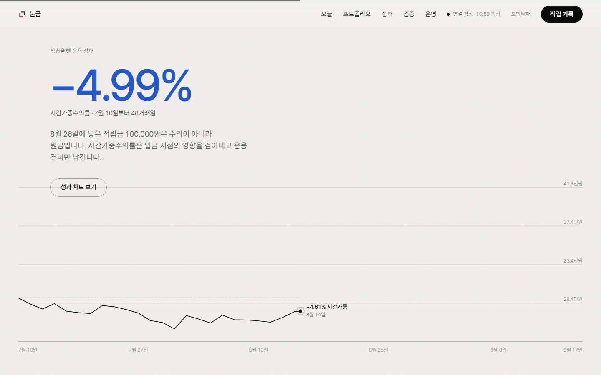
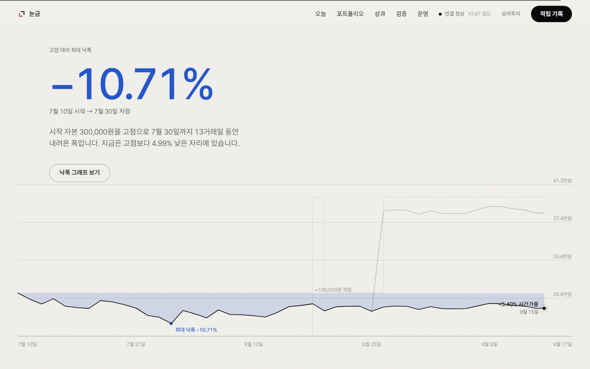
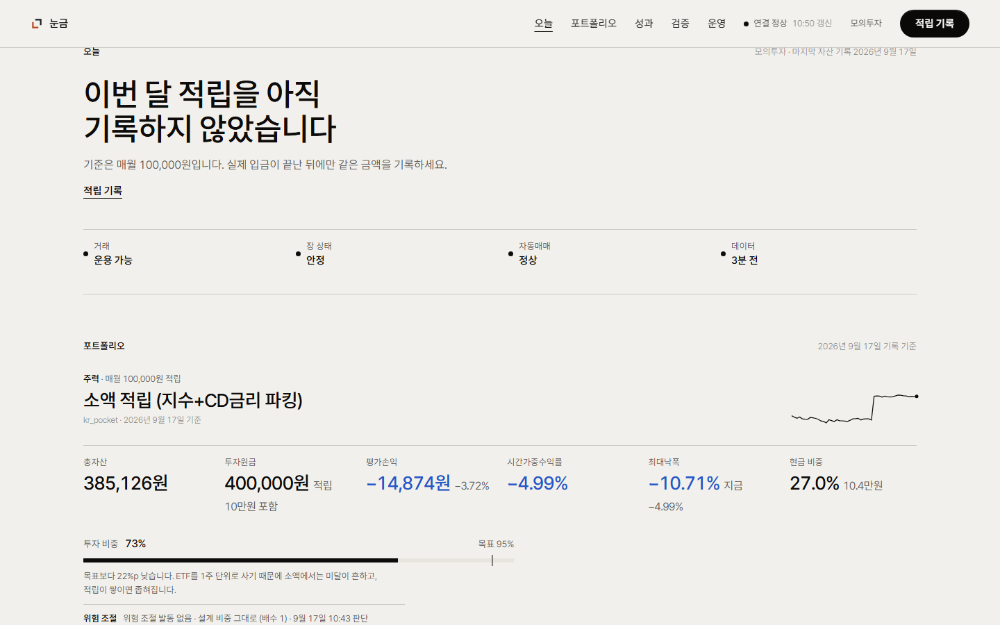
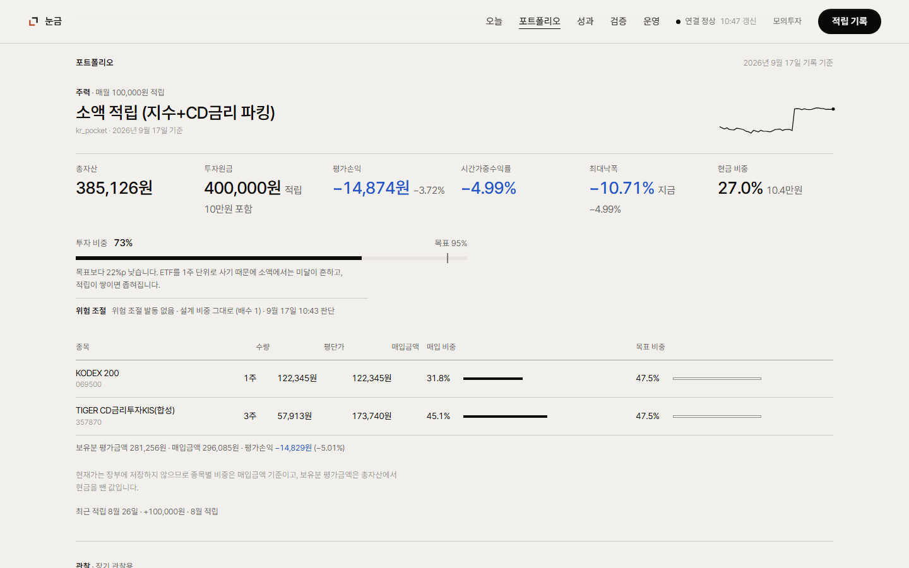
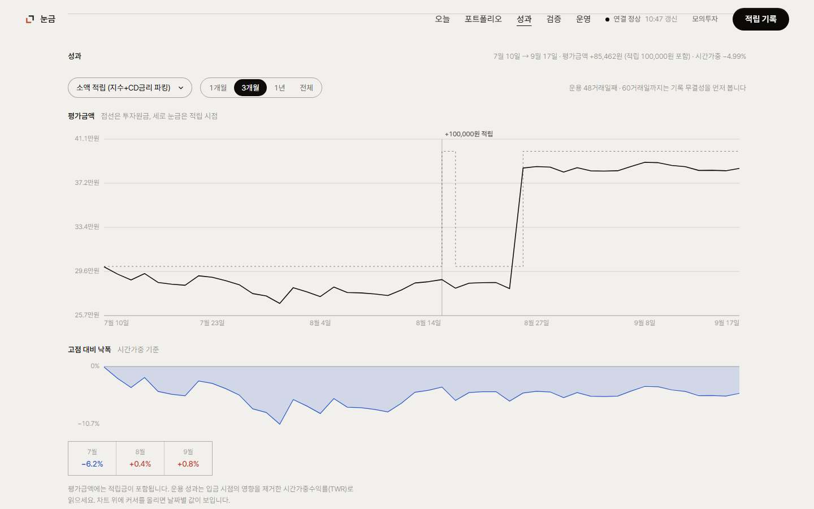
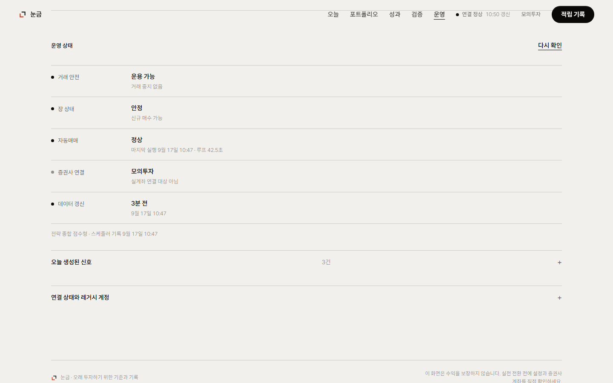

# 눈금 — 오래 투자하기 위한 기준과 기록

한국 주식 ETF·대형주 바스켓을 매일 자동으로 굴리고, 그 결과를 숫자로 남기고, 정한 기준을 지키게 만드는 개인용 퀀트 시스템입니다. 주가를 맞히는 프로그램이 아닙니다. 종목을 고르는 알파는 없다는 걸 검증으로 확인했고, 그 대신 **비용을 최소로 시장 수익(베타)을 담고, 떨어질 때 덜 잃는 것**에 집중합니다.



## 한눈에 보기

| | 내용 |
|---|---|
| 하는 일 | 한국 주식 바스켓 자동 리밸런싱, 매일 자산 기록(NAV), 적립 관리, 운영 상태 감시, 웹 대시보드 |
| 지금 굴러가는 것 | 모의투자 2개 트랙 (실전 주문은 운영자가 직접 켜기 전엔 나가지 않음) |
| 주력 트랙 | `kr_pocket` — 코스피200 ETF + CD금리 ETF, 시작 30만원에 매월 10만원 적립 |
| 관찰 트랙 | `kr_diversified_hold` — 대형주 9종목 동일비중, 주식 60% / 현금 40% |
| 리스크 관리 | 주식 비중 고정 + 2026-09 추가한 추세 필터·낙폭 제어 오버레이, 거래 중지·급락 감지·갭 방어 |
| 기술 | Python 3.11/3.12, aiohttp, SQLite, FinanceDataReader/pykrx, KIS API(모의·실전), 대시보드는 순수 HTML/CSS/JS |

## 돈이 어떻게 굴러가나

두 트랙 모두 `config/baskets.yaml`에 선언된 목표 비중을 향해 큰 이탈이 생길 때만 사고팝니다. 매일 아침 스케줄러가 시세를 받아 리밸런싱이 필요한지 보고, 그날의 총자산을 장부에 남깁니다. 적립금은 수익이 아니므로 시간가중수익률(TWR)로 분리해서 계산합니다.

| 트랙 | 구성 | 목표 주식 비중 | 리밸런싱 | 손절 |
|---|---|---|---|---|
| `kr_pocket` (주력) | KODEX 200 50% + TIGER CD금리 50% | 95% 투자 (지수 47.5 · 파킹 47.5) | 비중 8%p 이탈 시 | 없음 — 지수 적립식이라 비중으로만 위험 통제 |
| `kr_diversified_hold` (관찰) | 삼성전자·현대차·NAVER 등 9종목 동일비중 | 60% | 비중 8%p 이탈 시, 회전 상한 15% | 종목 −25%, 재매수 금지 60일 |

정직한 기대치는 이렇습니다. 2022년 약세장을 포함한 검증에서 대형주 동일비중 보유는 연 13% 안팎, 주식 50%짜리 적립 트랙은 연 7~9%였습니다. 강세장 한 번의 숫자(연 30%대)는 상한이지 약속이 아닙니다. 자세한 근거는 [docs/PROFITABILITY_FINDINGS.md](docs/PROFITABILITY_FINDINGS.md)에 있습니다.

## 2026년 9월 업데이트 — 손실을 줄이는 두 가지 규칙


"수익률을 올리는 신호"는 여러 번 시도해서 전부 시장 보유에 졌습니다. 그래서 이번에는 **주식 비중을 언제 줄이는지**만 바꿨습니다. 2002년부터의 코스피200, 2014년부터의 KODEX 200 실제 ETF, 2021년 말부터의 대형주 10종목으로 같은 비용·같은 적립 규칙 아래 비교했습니다.

| 규칙 | 무엇을 하나 | 적립 트랙(ETF, 2014~) 결과 |
|---|---|---|
| 추세 필터 | 코스피200이 200일선 아래로 2% 넘게 내려가면 주식 비중을 절반으로, 위로 2% 넘게 올라와야 복귀 | 연수익률 9.6 → 9.3%, 최악 연도 −11.2 → −4.6%, 샤프 0.59 → 0.62 |
| 낙폭 제어 | 시간가중 자산이 고점 대비 −10% 아래면 절반, −5% 안으로 회복해야 복귀 | 최대낙폭 −21.7 → −17.3% (추세 필터와 함께 −16.3%) |
| 변동성 목표 | 실현 변동성이 20%를 넘으면 그만큼 축소 | 연수익률을 2~4%p 깎아 **기본 꺼 둠** |

주력 적립 트랙에는 추세 필터와 낙폭 제어를 켰습니다. 관찰 트랙은 60거래일 검증을 끝내고 실전 전환 승인을 기다리는 중이라 권장값만 적어 두고 껐습니다. 전체 표와 읽는 법은 [docs/RISK_OVERLAY_FINDINGS.md](docs/RISK_OVERLAY_FINDINGS.md), 재현은 `python tools/risk_overlay_backtest.py`입니다.

## 화면

대시보드는 매일 아침 한 번 보는 용도로 만들었습니다. 첫 화면은 스크롤에 따라 자산 곡선이 그려지면서 총자산, 적립을 뺀 수익률, 최대 낙폭을 차례로 보여줍니다.



**오늘** — 확인할 일이 있으면 그것만 먼저 말합니다. 적립을 아직 기록하지 않았는지, 자동매매가 멈췄는지, 거래가 중지됐는지. 없으면 "오늘은 손댈 것이 없습니다"라고 씁니다.



**포트폴리오** — 트랙별 총자산·투자원금·평가손익·시간가중수익률·최대낙폭·현금 비중, 투자 비중과 목표, 종목별 매입 비중과 목표 비중, 그리고 오늘 위험 조절 규칙이 무엇을 판단했는지.



**성과** — 평가금액(점선은 투자원금, 세로 눈금은 적립 시점), 고점 대비 낙폭, 월별 시간가중수익률. 차트 위에 커서를 올리면 날짜별 값이 보입니다.



**검증·운영** — 60거래일 모의투자 검증 진행률, 거래 안전·장 상태·자동매매·증권사 연결·데이터 갱신 상태, 오늘 생성된 신호, 웹소켓 연결 이력.



## 실행하기

Python 3.11 또는 3.12가 필요합니다.

```bash
git clone https://github.com/easygap/quant_trader.git
cd quant_trader
python -m venv .venv
.venv\Scripts\Activate.ps1        # macOS/Linux: source .venv/bin/activate
pip install -r requirements.txt
cp config/settings.yaml.example config/settings.yaml
cp .env.example .env
python main.py --mode dashboard   # http://127.0.0.1:8080
```

처음 실행해 화면에 기록이 없다면 모의투자 사이클을 한 번 돌립니다.

```bash
python main.py --mode rebalance --basket kr_pocket --dry-run   # 주문 미리보기
python main.py --mode rebalance --basket kr_pocket             # 모의투자 실행 + 자산 기록
```

매일 자동으로 돌리려면 `python main.py --mode schedule`을 작업 스케줄러나 systemd에 등록합니다. 적립금은 대시보드의 **적립 기록** 버튼이나 `python tools/record_deposit.py --basket kr_pocket --amount 100000`으로 남깁니다. KIS 모의투자나 알림을 쓸 때만 `.env`를 채우고, `.env`와 계좌 정보는 Git에 올리지 않습니다.

## 안전장치

실전 주문은 다음이 모두 맞아야만 나갑니다. 60거래일 이상의 모의투자 기록, 기록 누락 5% 이하, 실패 주문 0건, 연 비용 1% 이하, `--mode live --confirm-live` 명시. 그 밖에 전역 거래 중지(HALT), 개별 종목 −5%·포트폴리오 −3% 급락 감지, 갭다운 −3% 즉시 청산, 일일 손실 3%·낙폭 15% 한도가 있습니다. 상세는 [docs/SAFETY_MODEL.md](docs/SAFETY_MODEL.md)와 [docs/OPERATING_PRINCIPLES.md](docs/OPERATING_PRINCIPLES.md)를 보세요. 후자는 이 저장소에서 실제로 났던 사고(오류 0건인데 설계대로 안 돌던 경우들)에서 뽑은 원칙입니다.

## 백테스트와 연구

```bash
python tools/risk_overlay_backtest.py                 # 오버레이 비교 (본 README 그림)
python main.py --mode validate --strategy scoring --symbol 005930 --walk-forward --validation-years 5
python tools/buy_hold_robustness.py                   # 대형주 보유의 연도별 강건성
python tools/static_allocation_analysis.py            # 주식·현금 비중별 낙폭
```

신호형 전략(`scoring` 등)은 정직 평가에서 동일비중 보유 대비 −140%p 뒤져 `paper_only`로 강등돼 있습니다. 백테스트 결과가 나쁘게 보이는 건 버그가 아니라 그 결론 자체입니다. 왜 그런지, 무엇을 시도했는지는 [docs/RESEARCH_LOG.md](docs/RESEARCH_LOG.md)에 날짜별로 남겨 두었습니다.

## 문서

- [docs/PROJECT_GUIDE.md](docs/PROJECT_GUIDE.md) — 구조와 흐름, 파일별 역할
- [docs/PROFITABILITY_FINDINGS.md](docs/PROFITABILITY_FINDINGS.md) — 수익성 정직 점검 결론
- [docs/RISK_OVERLAY_FINDINGS.md](docs/RISK_OVERLAY_FINDINGS.md) — 추세 필터·낙폭 제어 검증 (2026-09)
- [docs/POCKET_TRACK_PLAN.md](docs/POCKET_TRACK_PLAN.md) — 소액 적립 트랙 설계와 기대치
- [docs/BASKET_PAPER_EVALUATION.md](docs/BASKET_PAPER_EVALUATION.md) · [docs/PAPER_TO_LIVE_RUNBOOK.md](docs/PAPER_TO_LIVE_RUNBOOK.md) — 모의투자 검증 기준과 실전 전환 절차
- [docs/BACKTEST_IMPROVEMENT.md](docs/BACKTEST_IMPROVEMENT.md) — 미래 정보 누출·생존 편향·비용 반영 내역

이 저장소는 수익과 원금을 보장하지 않습니다. 실전 전환 전에 설정과 증권사 계좌를 직접 확인하세요.
