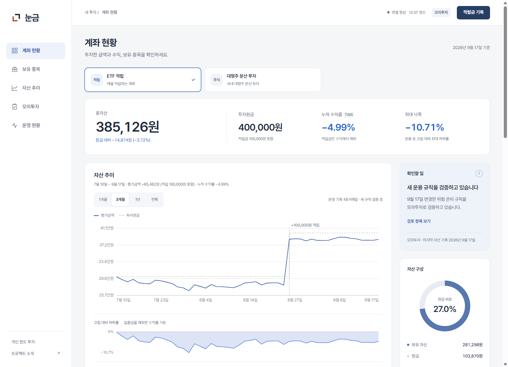
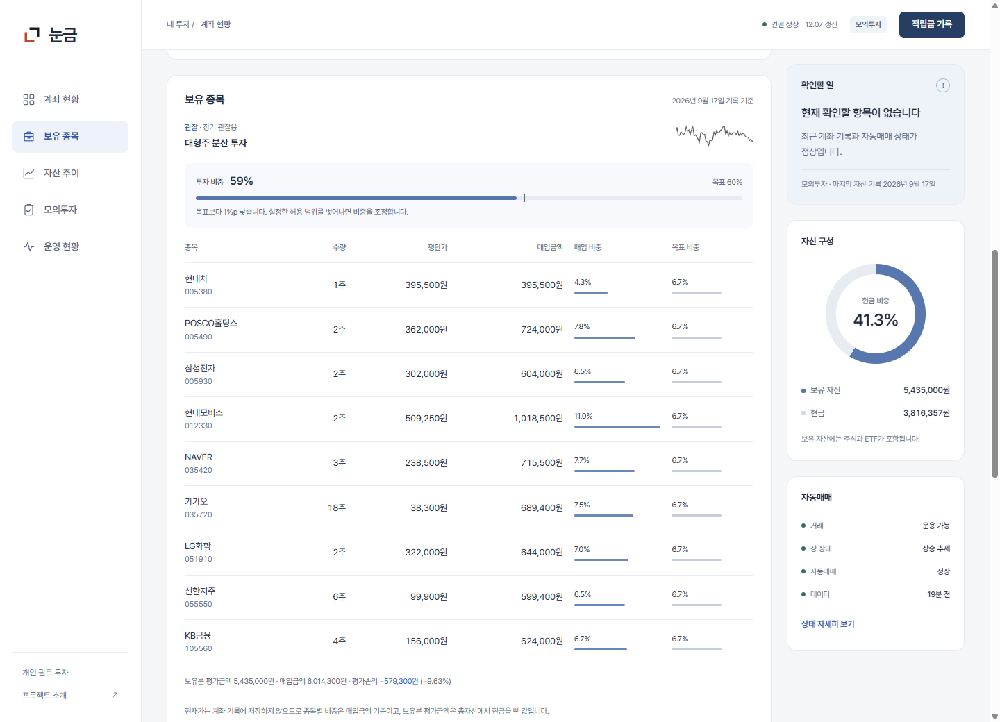
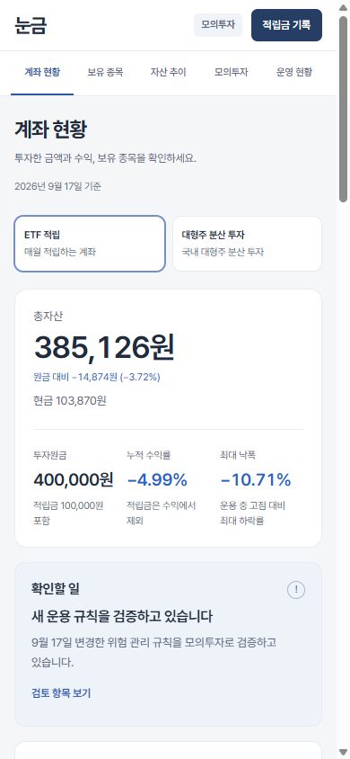

# 계좌 화면 설계와 확인 결과

기준일: 2026-09-17

요청한 방향은 계좌 화면을 중심으로 다시 구성하고, 제시한 영상 스크롤 예시에서는 글꼴의 위계·여백·짧은 전환만 참고하는 것이었습니다. 기존 Python·aiohttp·SQLite와 순수 HTML/CSS/JavaScript 구조를 유지했습니다.

## 화면 구성

첫 화면에서 계좌를 고르고 총자산·투자원금·누적 수익률·최대 낙폭을 확인합니다. 아래에는 자산 추이, 보유 종목, 모의투자 검증, 자동매매 상태가 이어집니다. 데스크톱 오른쪽에는 확인할 일과 자산 구성을 두고, 모바일에는 중요한 안내와 현금 잔액을 먼저 보여 줍니다.

모바일 화면

사진처럼 만든 예시 화면이나 가공한 수익률 대신 실제 모의투자 API 응답을 캡처했습니다. 촬영 중 주문이나 적립금 기록을 전송하지 않았습니다.

## 글꼴·색·문구

| 항목 | 선택 |
|---|---|
| 글꼴 | Pretendard 1.3.9 기반 로컬 서브셋. 배포 이름 Nungum UI, 굵기 400~700 |
| 크기 | 본문 14px, 제목 23~26px, 주요 잔액 29~40px, 계좌 핵심 수치 19~27px, 보조 표기 최소 11px |
| 숫자 | `tabular-nums`, 금액 열 오른쪽 정렬, 원화·주·% 단위 명시 |
| 바탕 | 연한 회색 `#f5f6f8`, 콘텐츠 면은 흰색 |
| 본문·선택 | 본문 `#202b3d`, 선택·행동 `#3157a4` |
| 손익 | 수익 `#c4383c`, 손실 `#2563c7`. 색과 함께 +/− 부호를 표시 |
| 한글 | `word-break: keep-all`, 긴 항목은 필요한 곳에서 줄바꿈 |
| 움직임 | 버튼 색·상태 전환 정도만 사용. 모션 줄이기 설정 존중 |

“계좌 현황”, “보유 종목”, “적립금 기록”, “고점 대비 하락률”처럼 화면에서 실제로 하는 일을 적었습니다. 모의투자 적립과 실제 입금은 설명을 나누고, 확인 창에는 계좌·금액·구분을 명시했습니다. 수익률을 부풀리는 홍보 문구는 사용하지 않았습니다.

폰트는 약 431KiB이며 외부 글꼴 서버를 호출하지 않습니다. [글꼴 출처와 수정 범위](../monitoring/static/fonts/README.md), [OFL 라이선스](../monitoring/static/fonts/OFL.txt)를 함께 제공합니다.

## 2026년 9월까지 확인한 자료

- [토스의 라이팅 원칙](https://toss.tech/article/8-writing-principles-of-toss), 2022-11-15: 짧고 자연스러운 한국어와 행동이 분명한 문구를 참고했습니다. 이를 2026년에 새로 나온 원칙으로 소개하지 않습니다.
- [토스 브랜드 디자인](https://toss.tech/article/43061), 2025: 금융 화면의 색과 글꼴을 일관되게 사용하는 사례를 살폈습니다. 토스 전용 글꼴이나 로고를 사용하지 않았습니다.
- [Pretendard 공식 저장소](https://github.com/orioncactus/pretendard): 한글과 라틴 숫자를 함께 다루는 글꼴과 배포 조건을 확인했습니다.
- [Web Platform Baseline](https://web.dev/baseline), [2026년 7월 Baseline 정리](https://web.developers.google.cn/blog/baseline-digest-jul-2026): 새 기능의 지원 범위를 확인했습니다. 이 화면에는 새 스크롤 타임라인이나 추가 프레임워크가 필요하지 않았습니다.
- [web.dev 애니메이션 가이드](https://web.dev/articles/animations-guide), [웹폰트 로드](https://web.dev/articles/optimize-webfont-loading): 불필요한 레이아웃 변경과 외부 요청을 줄이는 근거로 사용했습니다.

유행하는 시각 효과를 넣는 것보다 계좌 정보를 정확히 읽고 조작할 수 있는 구성을 우선했습니다. 배경 영상·WebGL·3D 라이브러리·스크롤 제어 라이브러리는 추가하지 않았습니다.

## 성능 측정

Chrome 153, 390×844 뷰포트, CPU 4배 감속, 다운로드 1.6Mbps, 지연 150ms, 브라우저 캐시를 끈 상태에서 로컬 서버에 접속했습니다. Playwright로 브라우저를 조작하고 Chrome DevTools Protocol과 PerformanceObserver로 측정했습니다. Chrome DevTools MCP는 기존 프로필과 충돌해 실행되지 않아, 이미 연결된 검증용 브라우저에서 같은 브라우저 API를 사용했습니다.

| 항목 | 마지막 측정 |
|---|---:|
| 첫 콘텐츠 표시(FCP) | 0.628초 |
| 가장 큰 콘텐츠 표시(LCP) | 0.628초 |
| 계좌·차트 데이터 표시 | 1.64초 |
| 레이아웃 이동량(CLS) | 0.034 |
| 관찰한 주요 조작의 Event Timing | 40~56ms |
| 50ms 초과 긴 작업의 초과분 합계 | 118ms |
| 로드 후 1.2초 유휴 구간의 rAF 예약 | 0회 |
| HTML·정적 파일·초기 API 응답 전송 합계 | 약 528KiB |
| CSS + JS 전송 본문 | 약 26.6KiB |
| 외부 출처 리소스 요청 | 0건 |

LCP는 계좌 데이터가 모두 준비되는 시간과 다릅니다. 한글 폰트는 이 조건에서 약 2.8초가 걸렸으며, 그동안 시스템 글꼴로 먼저 표시합니다. 글꼴 적용 과정에 긴 작업도 관찰됐습니다. CSS·JS·SVG 압축과 정적 파일 재검증을 적용했고, 계좌 API의 `no-store`는 유지했습니다.

이 숫자는 **한 PC에서 수행한 실험실 측정**입니다. Event Timing 표본은 실제 사용자 전체의 INP가 아니며, 긴 작업 초과분도 Lighthouse가 계산한 TBT 점수와 동일하지 않습니다. [Web Vitals 공식 설명](https://web.dev/articles/vitals)처럼 실험실 결과와 실제 기기·네트워크의 체감은 구분해야 합니다. 모든 기기에서 지연이 0이라고 보장하지 않습니다.

[원본 측정 JSON](../reports/research/dashboard_performance_20260917.json)에 환경, 요청별 전송량, 긴 작업과 입력 시간 표본을 남겼습니다. 화면에는 성능 수집 코드를 추가하지 않았습니다.

## 화면에서 확인한 항목

- 320·390·768·1024·1440px와 844×390 가로 화면에서 문서 가로 넘침 없음
- 주요 버튼 높이 36px 이상, 보조 텍스트 11px 이상
- 계좌를 바꾸면 잔액·차트·보유 종목·확인할 일·적립금 입력 대상이 함께 변경
- 3개월에서 1개월로 바꿔도 같은 달의 월 수익률은 같음
- 조회 기간 바깥의 고점도 낙폭 계산에 반영
- 적립금을 과거 복원 행의 저장 시각으로 당겨 반영하지 않음
- 숨긴 계좌 선택기가 키보드 포커스를 받지 않음
- 대화상자 취소·Escape 동작, 닫은 뒤 실행 버튼으로 포커스 복귀
- 320px에서 적립금 입력 창이 화면 안에 표시됨
- API 실패 시 오류 안내와 적립금 기록 제한, 폰트 실패 시 대체 글꼴 표시
- `prefers-reduced-motion`에서 버튼 전환 제거
- 실제 데이터로 다시 로드한 화면의 JavaScript 오류·경고 0건

iOS Safari 실기기와 다양한 Android 기기의 현장 성능은 이번 로컬 검사에 포함하지 않았습니다. 안전 영역과 터치 크기·입력 동작은 CSS 및 브라우저 뷰포트 검사로 확인했습니다.

## 유지한 구조

`monitoring/templates/dashboard.html`, `monitoring/static/dashboard.css`, `monitoring/static/dashboard.js`와 기존 aiohttp 서버를 사용합니다. JS는 한 IIFE로 실행하며 새 프런트엔드 런타임 의존성이나 빌드 단계를 추가하지 않았습니다. 차트는 Canvas, 자산 구성은 CSS로 표시합니다. 유휴 상태에서 계속 도는 애니메이션 루프는 없습니다.
