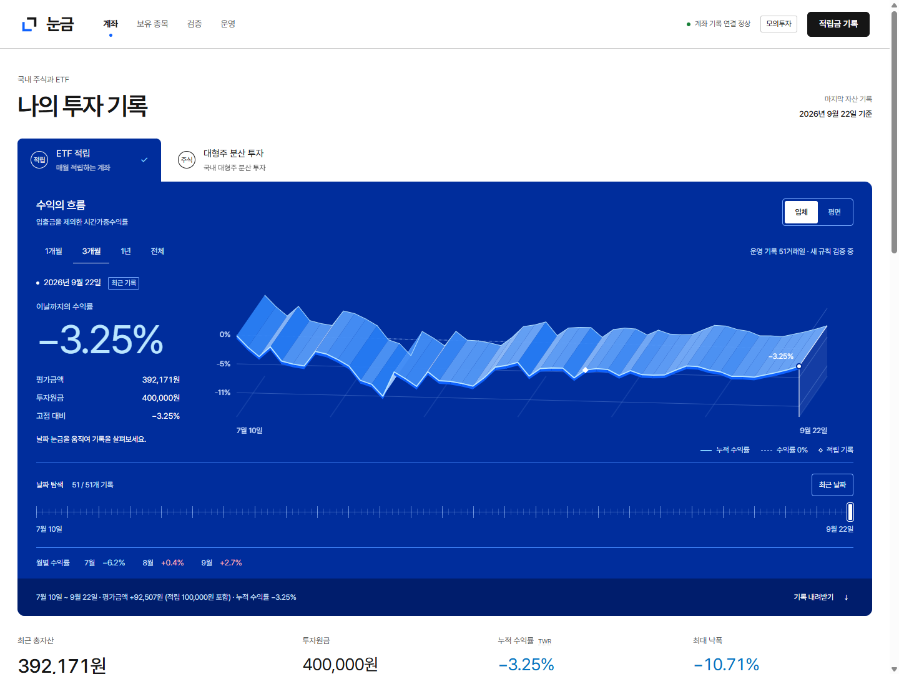
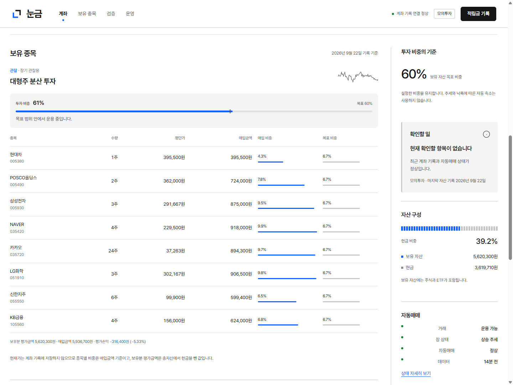

# 눈금: 투자 기록을 재는 도구

2026년 9월 22일 개편의 설계 기준입니다. 계좌를 읽는 도구라는 목적과 기존 HTML/CSS/JavaScript·aiohttp 구조를 유지합니다.

## 방향

흰 카드가 반복되던 화면을 하나의 계측 화면과 기록 영역으로 나눕니다. 눈금, 기준선, 선택일 표시가 같은 조작을 설명하게 합니다. 대표 시각 요소는 **실제 시간가중수익률로 그리는 입체 띠**입니다. 입금 때문에 자산이 갑자기 늘어난 것을 투자 성과처럼 연출하지 않습니다. 입체감은 같은 수익률 선에 폭을 준 표현이며, 숨겨진 제3의 지표가 아닙니다. 평면 보기와 원본 표를 함께 제공합니다.

```
눈금              계좌 / 보유 종목 / 검증 / 운영              연결 · 적립
나의 투자 기록                                  마지막 자산 기준일
계좌 선택
┌ 선택일 수익률 ───────── 실제 수익률의 입체 궤적 ────────────┐
│ 평가금액 / 원금         기준선, 날짜, 입금 표시        평면 전환 │
│                         ← 날짜 탐색 눈금 →                  │
└ 월별 수익률 ─────────────────────────────────────────────┘
최신 총자산             원금             수익률             최대 낙폭
보유 종목·원본 기록                         자산 구성·비중 판단 근거
모의투자 검증                              확인할 일
운영 기록
```

## 색과 글자

색상값은 IBM Carbon의 공개 색상표를 사용하고 역할을 분리합니다. 색상표를 쓰는 것과 컴포넌트를 복사하는 것은 구분합니다. 화면 구조와 입체 날짜 탐색은 눈금의 계좌 기록에 맞춰 직접 구현했습니다.

| 역할 | 색상 | 참고 규격 |
|---|---|---|
| 페이지 | `#FFFFFF` | White |
| 보조 면 | `#F4F4F4` | Gray 10 |
| 본문·주요 버튼 | `#161616` | Gray 100 |
| 선택·링크·로고 | `#0F62FE` | Blue 60 |
| 주요 차트 바탕 | `#002D9C` | Blue 80 |
| 차트 선·선택한 기록 | `#82CFFF`, `#FFFFFF` | Cyan 30, White |
| 상승·하락 수치 | `#DA1E28`, `#0072C3` | Red 60, Cyan 60 |

어두운 차트의 손익 수치는 더 밝은 Red 30·Cyan 20으로 바꿉니다. 입체 면의 명암은 데이터의 추가 변수가 아닌 조명 표현입니다. 양수·음수 기호를 함께 표시합니다. 안내는 회색·파랑, 연결 실패나 거래 중지 알림은 회색 면과 빨간 선으로 구분합니다. 중요한 장애 알림은 모바일에서도 페이지 위쪽에 표시합니다.

한글은 기존 로컬 Nungum UI 글꼴을 유지합니다. 제목 30~40px, 주요 성과 숫자 37~66px, 본문 14~15px, 표와 좁은 화면의 보조 표기는 11~13px입니다. 숫자는 같은 폭으로 정렬합니다. 글꼴과 연출용 외부 요청은 없습니다.

## 조작과 연출

- 날짜 슬라이더·차트 포인터·키보드로 동일한 날짜를 선택합니다. 수익률, 평가금액, 원금, 낙폭이 함께 바뀝니다.
- 입체·평면 전환은 좌표계를 바꾸는 짧은 전환 한 번으로 보여줍니다. 상시 재생하는 영상이나 회전 물체를 두지 않습니다.
- 계좌 변경 중에는 이전 계좌의 차트와 새 계좌의 이름이 섞이지 않도록 합니다.
- 최신 계좌 요약과 선택한 과거 날짜의 수치를 구분합니다.
- 작은 화면에서는 선택일 숫자, 차트, 날짜 조작 순서로 배치합니다. 동작 줄이기 설정에서는 전환을 생략합니다.

## 화면의 차별성을 두는 곳

색의 역할은 공개된 전문 디자인 규격을 따릅니다. 눈금의 차별성은 실제 날짜를 고르는 눈금, 같은 기록을 입체와 평면으로 바꾸는 조작, 원금과 수익을 분리하는 데이터 구성에 둡니다. 꾸밈용 영문이나 수익을 과장하는 문구는 넣지 않습니다.

## 참고 자료

- [IBM Carbon 색상 가이드, 2026-08-12 갱신](https://preview.carbondesignsystem.com/building-blocks/foundations/color/overview): 중성 회색의 단계, 배경별 글자 대비, 색의 역할.
- [Carbon 데이터 시각화 색상표, 2026-09-09 갱신](https://carbondesignsystem.com/data-visualization/color-palettes/): Blue·Cyan·Red의 실제 HEX 값. 신규 유행 자료가 아닌 현재 공개된 색상 규격입니다.
- [Pentagram — PayPal](https://www.pentagram.com/work/paypal): 흑백 중심의 구조와 파랑 강조, 실제 지불 동작을 출발점으로 한 모션. 기존 디자인 사례이며 2026년 신작이라고 소개하지 않습니다.
- [2026 Webby 시각 디자인 수상작](https://winners.webbyawards.com/winners/websites-and-mobile-sites/features-design/best-visual-design-aesthetic): Igloo Inc 등의 수상 여부 확인. 수상작 하나를 전체 웹 디자인의 유행이라고 단정하지 않습니다.


- [Webby 2026 데이터 시각화 수상작](https://winners.webbyawards.com/winners/websites-and-mobile-sites/features-design/best-data-visualization): 실제 데이터를 탐색하게 만드는 화면 구성 사례.
- [Teenage Engineering OP–XY 조작 체계](https://teenage.engineering/guides/op-xy/layout): 표시와 조작의 대응 관계를 참고했습니다. 제품 외형을 복제하지 않습니다.
- [web.dev 애니메이션 성능](https://web.dev/articles/animations-and-performance): 합성 가능한 짧은 전환과 불필요한 재계산 억제.
- [web.dev Canvas 성능](https://web.dev/articles/canvas-performance): 반복 도형의 그리기 횟수와 해상도를 제한하는 구현 원칙. 오래된 원리 문서이며 2026년 새 기능으로 소개하지 않습니다.

## 실제 화면





## 화면·조작 검증

2026-09-22 로컬 모의투자 기록으로 확인했습니다. 운영 계좌에 주문이나 적립을 추가하지 않았습니다.

- 320·390·768·1440px에서 페이지 가로 넘침 없음. 입체·평면 버튼 높이는 36px 이상.
- 날짜 슬라이더 Home·방향키·최근 날짜 복귀, 기간 변경, 두 계좌 전환 확인.
- ETF 계좌 51개 일별 기록을 CSV로 내려받아 행 수·첫 날짜·원금·수익률 확인.
- 기록이 없으면 빈 상태, 잘못된 금액이나 적립금 조회 실패 시 오류 표시 및 내려받기 제한.
- 운영 상태 조회 실패 시 상단 알림과 적립 기록 제한 확인. 정상 상태에 경고 색을 사용하지 않음.
- `prefers-reduced-motion`에서 입체·평면 전환 생략. 일별 표와 낙폭 차트로 같은 기록 확인.
- 실제 화면의 브라우저 경고·오류 0건. 오류 상황은 별도 탭에서 응답을 바꿔 확인.

초기 검토에서 작은 화면을 바꾼 직후의 캡처가 Canvas 크기 갱신보다 빨랐습니다. 크기 변경 후 다시 그려지는 것을 확인하고 최종 캡처를 교체했습니다. 일반 안내까지 빨갛게 표시되던 부분과 버튼 높이도 함께 수정했습니다.

## 성능 측정

Playwright에서 Chrome DevTools Protocol과 PerformanceObserver로 측정했습니다. 별도 DevTools 프로필이 사용 중이라 기존 Playwright 브라우저로 진행했습니다. Chromium 153.0.8010.53, 390×844px, CPU 4배 감속, 지연 150ms, 다운로드 200,000B/s, 캐시 비활성화 조건의 로컬 서버 단일 측정입니다.

| 항목 | 결과 |
|---|---:|
| LCP | 1.16초 |
| CLS | 0.0133 |
| 입체·평면 및 키보드 조작의 최대 Event Timing | 56ms |
| 조작 없는 1초 동안 새 rAF 요청 | 0회 |
| CSS 전송량 / 원본 | 약 7.4 / 34.2KiB |
| JS 전송량 / 원본 | 약 24.0 / 85.9KiB |
| 로컬 한글 글꼴 | 약 431KiB |

새 렌더링 라이브러리·외부 글꼴·영상·3D 모델 요청은 없습니다. 차트는 최대 약 420개 선분으로 그리고, 날짜 변경은 프레임당 한 번, 보기 전환은 360ms 동안만 그립니다. 숨은 탭의 주기 조회는 기존 정책대로 쉬게 했습니다. 전체 이력은 조회 주기에 한 번 받아 계좌·기간 변경에 재사용합니다.

이 값은 실제 사용자 집계인 INP나 모든 기기의 무지연 보장이 아닙니다. 글꼴이 초기 전송량의 대부분이며, 감속 조건에서 초기 로딩 중 125·99·346ms의 긴 작업이 관찰됐습니다. 연출을 쓰지 않을 때 계속 CPU를 점유하지 않는지 별도로 확인했습니다.
