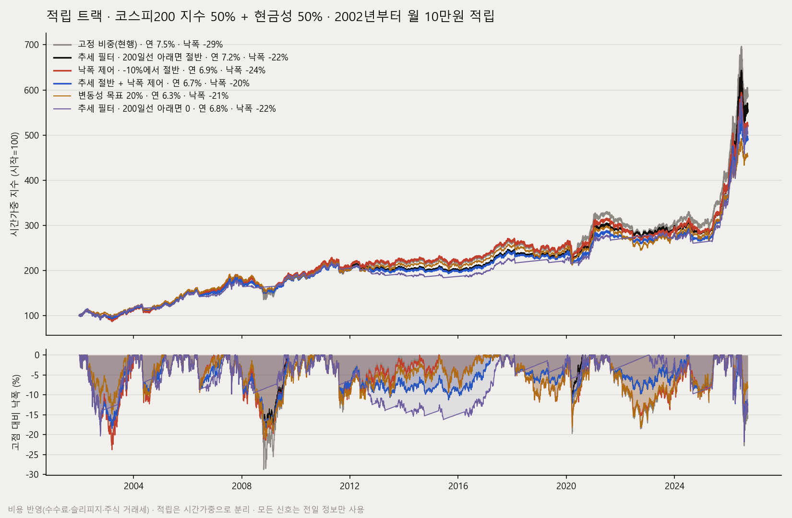
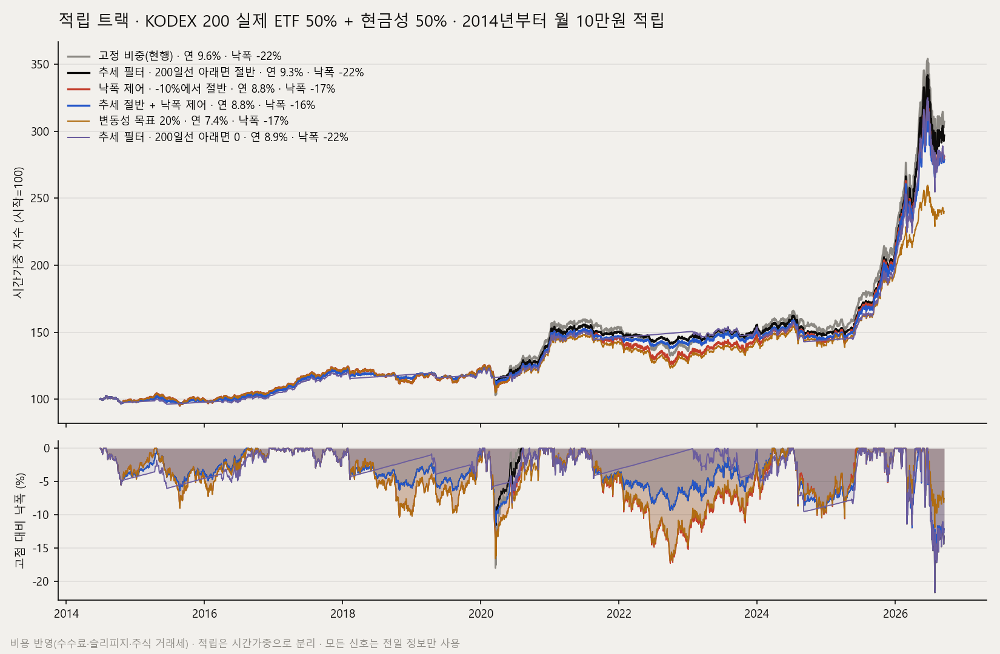
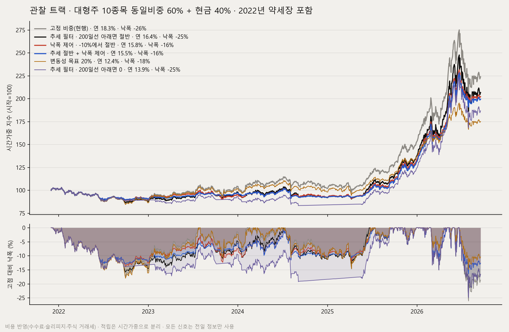

# 리스크 오버레이 검증 — 주식 비중을 언제 줄이면 손실이 얼마나 줄어드는가

> 작성 2026-09-17. 재현: `python tools/risk_overlay_backtest.py` → `reports/research/risk_overlay_backtest.{md,json}`, 그림은 `docs/images/overlay-*.png`.

## 왜 이 실험인가

이 저장소의 확정 결론([PROFITABILITY_FINDINGS.md](PROFITABILITY_FINDINGS.md))은 두 줄이다.

1. 넓은 유니버스에서 종목 선택으로 시장을 이기는 알파는 없었다. 모멘텀·저변동성·리스크패리티·SMA 리스크오프 전부 동일비중 보유에 졌다.
2. 손익의 크기를 정하는 것은 주식 비중이다. 주식 50~60%면 낙폭이 절반이 되고 샤프는 오히려 오른다([STATIC_ALLOCATION.md](STATIC_ALLOCATION.md)).

그래서 "수익률을 높이는 새 신호"를 찾는 대신, **이미 운용 중인 두 트랙의 주식 비중을 언제 줄이고 언제 되돌리는지**만 바꿔 봤다. 종목은 그대로, 비용은 실제와 같게, 적립은 시간가중으로 분리해서.

2026년 기준으로 참고한 근거는 이렇다.

- 변동성 목표(vol targeting)는 주식·크레딧에서 샤프를 높이고 왼쪽 꼬리를 줄인다. 채권·통화·원자재에서는 효과가 거의 없다. — [Man Group, The Impact of Volatility Targeting](https://www.man.com/insights/the-impact-of-volatility-targeting)
- 10개월(≈200일) 이동평균 규칙은 1901~2012년 미국 주식에서 연수익률을 유지하며 최대낙폭을 −83%에서 −50%로 줄였고, 2025년까지 연장한 검증에서도 유효했다. 월 1회 평가로 회전이 낮다는 점이 핵심이다. — [Faber, A Quantitative Approach to Tactical Asset Allocation](https://www.trendfollowing.com/whitepaper/CMT-Simple.pdf), [CXO Advisory 재검증](https://www.cxoadvisory.com/technical-trading/long-term-outperformance-from-trends-defined-by-moving-averages/)
- 2026년 상반기 코스피 일간 변동성은 3.6%로 2025년(1.4%)의 두 배를 넘었다. 위험 관리가 더 중요해진 환경이다. — [자본시장연구원](https://www.kcmi.re.kr/report/report_view?report_no=2315)
- 2026년 1월부터 코스피 증권거래세는 0.05% + 농특세 0.15% = 매도 금액의 0.20%다. 국내 주식형 ETF는 거래세가 없다. 회전이 많은 정책일수록 개별 주식 트랙에서 불리하고, ETF 트랙에서는 부담이 작다. — [머니투데이](https://www.mt.co.kr/economy/2025/12/01/2025120108471236062), [KCIE ETF 세금 안내](https://www.kcie.or.kr/mobile/guide/3/18/web_view?series_idx=&content_idx=900)
- 2026년 시스템 운용의 화두는 "수익률보다 위기 국면에서의 행동"이다. 개인 투자자의 가장 큰 위험은 손실 구간에서 전략을 버리는 것이고, 정해진 손실 한도와 기계적 리밸런싱이 그 위험을 줄인다. — [HedgeNordic, Systematic Strategies 2026](https://hedgenordic.com/2026/06/systematic-strategies-2026/), [BNP Paribas AM](https://www.bnpparibas-am.com/en-us/institutional/forward-thinking/quant-investing-in-2026-data-ai-and-human-judgment/)

## 실험 설계

| 항목 | 내용 |
|---|---|
| 트랙 1 (적립) | 위험자산 1개(코스피200 지수 2002~ / KODEX 200 ETF 2014~) + 현금성(연 3%) · 목표 주식 비중 50% · 시작 30만원, 매월 10만원 적립 |
| 트랙 2 (관찰) | 대형주 10종목 동일비중을 하나의 지수로 묶음 · 목표 주식 비중 60% · 2021-12~2026-09 (2022년 약세장 포함) |
| 비용 | ETF: 편도 수수료 0.015% + 슬리피지 0.05%, 거래세 없음. 주식: 매도 시 0.20% 추가 |
| 리밸런싱 | 목표와 실제 비중 차이 8%p 초과, 또는 정책 배수가 바뀐 날 |
| 신호 | 전부 전일까지의 정보만 사용 |
| 성과 | 시간가중수익률(적립은 수익이 아님), 최대낙폭, 샤프, 칼마, 최악 연도, 손실 연도 수, 연 회전율 |

정책은 다섯 가지와 그 조합이다.

- **추세 필터**: 코스피200이 200일선 아래로 2% 넘게 내려가면 주식 비중을 절반(또는 0)으로, 위로 2% 넘게 올라와야 복귀. 2% 띠(히스테리시스)가 없으면 선 근처에서 왕복 매매가 나 회전율이 3배가 된다.
- **낙폭 제어**: 시간가중 NAV가 고점 대비 −10% 아래면 절반, −5% 안으로 회복하면 복귀.
- **변동성 목표**: 최근 60일 실현 변동성이 목표(15% 또는 20%)를 넘으면 목표/실현 비율만큼 축소(0.1 단위, 하한 0.5).

## 결과

### 적립 트랙 · 코스피200 지수 · 2002-01 → 2026-09

| 정책 | 연수익률 | 최대낙폭 | 샤프 | 칼마 | 최악 연도 | 손실 연도 | 평균 주식 비중 | 연 회전율 |
|---|---:|---:|---:|---:|---:|---:|---:|---:|
| 고정 비중(현행) | +7.45% | −28.8% | 0.42 | 0.26 | −18.7% | 7/25 | 51% | 9% |
| **추세 필터 · 200일선 아래면 절반** | +7.19% | −21.8% | **0.45** | 0.33 | −12.3% | 7/25 | 41% | 54% |
| 추세 필터 · 200일선 아래면 0 | +6.79% | −21.8% | 0.44 | 0.31 | −6.8% | 10/25 | 31% | 102% |
| 변동성 목표 15% | +5.79% | −17.8% | 0.38 | 0.33 | −12.3% | 6/25 | 41% | 58% |
| 변동성 목표 20% | +6.32% | −20.9% | 0.39 | 0.30 | −14.7% | 6/25 | 46% | 30% |
| 낙폭 제어 · −10%에서 절반 | +6.91% | −23.8% | 0.41 | 0.29 | −14.6% | 7/25 | 48% | 32% |
| 추세 절반 + 낙폭 제어 | +6.66% | −20.3% | 0.43 | 0.33 | −13.1% | 7/25 | 41% | 68% |
| 추세 절반 + 변동성 20% | +6.22% | −13.8% | 0.44 | **0.45** | −8.9% | 7/25 | 37% | 69% |

### 적립 트랙 · KODEX 200 실제 ETF · 2014-06 → 2026-09

| 정책 | 연수익률 | 최대낙폭 | 샤프 | 칼마 | 최악 연도 | 손실 연도 | 평균 주식 비중 | 연 회전율 |
|---|---:|---:|---:|---:|---:|---:|---:|---:|
| 고정 비중(현행) | +9.62% | −21.7% | 0.59 | 0.44 | −11.2% | 4/13 | 51% | 17% |
| **추세 필터 · 200일선 아래면 절반** | +9.32% | −21.7% | 0.62 | 0.43 | **−4.6%** | 4/13 | 40% | 57% |
| 추세 필터 · 200일선 아래면 0 | +8.86% | −21.7% | 0.60 | 0.41 | −6.1% | 3/13 | 28% | 101% |
| 변동성 목표 15% | +6.59% | −15.7% | 0.48 | 0.42 | −10.0% | 4/13 | 44% | 69% |
| 변동성 목표 20% | +7.44% | −17.0% | 0.52 | 0.44 | −11.0% | 4/13 | 48% | 36% |
| 낙폭 제어 · −10%에서 절반 | +8.84% | −17.3% | 0.59 | 0.51 | −11.2% | 4/13 | 50% | 43% |
| **추세 절반 + 낙폭 제어** | +8.76% | **−16.3%** | **0.64** | 0.54 | −4.6% | 4/13 | 39% | 83% |
| 추세 절반 + 변동성 20% | +7.45% | −11.9% | 0.61 | 0.63 | −4.3% | 4/13 | 36% | 69% |

### 관찰 트랙 · 대형주 10종목 동일비중 · 2021-12 → 2026-09

| 정책 | 연수익률 | 최대낙폭 | 샤프 | 칼마 | 최악 연도 | 손실 연도 | 평균 주식 비중 | 연 회전율 |
|---|---:|---:|---:|---:|---:|---:|---:|---:|
| 고정 비중(현행) | +18.32% | −26.1% | 0.82 | 0.70 | −13.5% | 2/6 | 61% | 22% |
| 추세 필터 · 200일선 아래면 절반 | +16.36% | −24.9% | 0.76 | 0.66 | −12.6% | 2/6 | 53% | 86% |
| 추세 필터 · 200일선 아래면 0 | +13.92% | −24.9% | 0.65 | 0.56 | −11.3% | 2/6 | 45% | 150% |
| 변동성 목표 15% | +9.70% | −15.1% | 0.61 | 0.64 | −11.8% | 2/6 | 41% | 97% |
| 변동성 목표 20% | +12.40% | −18.0% | 0.71 | 0.69 | −14.2% | 2/6 | 51% | 100% |
| **낙폭 제어 · −10%에서 절반** | +15.84% | **−16.4%** | **0.85** | **0.97** | −10.6% | 2/6 | 43% | 78% |
| 추세 절반 + 낙폭 제어 | +15.50% | −16.4% | 0.86 | 0.95 | −10.0% | 2/6 | 38% | 100% |
| 추세 절반 + 변동성 20% | +10.59% | −16.1% | 0.64 | 0.66 | −12.9% | 2/6 | 44% | 139% |

## 읽는 법 — 정직하게

- **수익률을 올리는 정책은 없다.** 전부 연수익률을 조금씩 깎는다. 이 결과는 확정 결론과 같은 말을 한다. 베타의 수익을 더 키우는 방법은 주식 비중을 높이는 것뿐이고, 그건 낙폭도 같이 키운다.
- **손실을 줄이는 정책은 있다.** 적립 트랙에서 추세 필터(절반)는 25년간 연수익률 0.26%p를 내주고 최악 연도를 −18.7%에서 −12.3%로, 최대낙폭을 −28.8%에서 −21.8%로 줄였다. 샤프는 오히려 올랐다. ETF 구간(2014~)에서도 최악 연도가 −11.2%에서 −4.6%로 줄었다.
- **추세 필터가 못 막는 낙폭이 있다.** ETF 구간의 −21.7%는 2020년 3월과 2026년 여름처럼 200일선 위에서 한 달 안에 무너진 구간이다. 이걸 줄이는 것은 낙폭 제어(−17.3%, 결합 시 −16.3%)다. 두 개는 서로 다른 종류의 하락을 맡는다.
- **변동성 목표는 한국에서 비싸다.** 고변동 구간이 고수익 구간(2020~21, 2024~26)이었기 때문에 연수익률을 2~9%p 깎는다. 이전 연구에서 역변동성 가중이 진 것과 같은 이유다. 옵션으로만 남기고 기본은 끈다.
- **관찰 트랙(개별 주식)은 낙폭 제어가 맞다.** 추세 필터는 거래세 때문에 회전 비용이 크고 낙폭도 거의 못 줄였다. 낙폭 제어는 최대낙폭 −26.1%→−16.4%, 샤프 0.82→0.85, 칼마 0.70→0.97에 연수익률 2.5%p를 내준다.
- **표본 한계.** 관찰 트랙은 4.8년, 강세장 비중이 크다. 적립 트랙의 2002~2014 구간은 배당을 뺀 가격지수라 실제보다 보수적이다. 모든 숫자는 소수 주 단위의 연구용 시뮬레이션이고 실제 운용은 1주 단위라 소액에서 오차가 생긴다.

## 운용 반영

| 트랙 | 적용 | 근거 |
|---|---|---|
| `kr_pocket` (적립, 주력) | **추세 필터 + 낙폭 제어 켬** (`config/baskets.yaml` `overlays`) | 이 트랙의 목적이 "낙폭 최소, 용돈 수준 수익"이라 연 0.3%p를 주고 최악 연도를 절반으로 줄이는 교환이 맞다. ETF라 회전 비용이 수수료뿐이다. 2026-09-17 현재 코스피200은 200일선 +12%, 낙폭 −5%라 켜도 당장 바뀌는 주문은 없다. |
| `kr_diversified_hold` (관찰) | **꺼 둠**, 낙폭 제어 권장값만 기록 | 60거래일 검증을 마치고 실전 전환 승인을 기다리는 중이다. 정책을 바꾸면 검증 대상이 달라지므로 승인 뒤 운영자가 결정한다. |
| `scoring` 등 신호 전략 | 손대지 않음 | 정직 평가에서 동일비중 보유 대비 −140%p로 이미 `paper_only`다. 오버레이로 고칠 문제가 아니라 구조(회전율 1,860%/년, 익절 상한)의 문제고, 확정 결론대로 돈이 실리는 경로가 아니다. |

구현은 `core/risk_overlays.py`(순수 함수·상태 파일)와 `core/basket_rebalancer.py`(설계 비중 × 배수)에 있다. 원칙은 세 가지다.

1. 배수는 설계를 대체하지 않고 곱한다. 설계 95% × 0.5 = 47.5%. 배치 진단·트리거·헬스·대시보드가 전부 "그날의 적용 비중"을 본다. 오버레이가 비중을 줄인 날 헬스가 미달 경보를 울리지 않는다.
2. 상태(추세 아래 / 낙폭 발동)는 `data/overlay_state/<basket>.json`으로 이어진다. 히스테리시스는 상태가 있어야 성립한다.
3. 데이터가 없으면 새 판단을 지어내지 않는다. 직전 상태를 유지하고 `data_issues`에 남기며, 대시보드가 그 사실을 보여준다. "오류 0건인데 설계대로 안 돈다"를 막기 위한 이 저장소의 관행이다.

끄는 방법은 `enabled: false` 한 줄이다. 다음 사이클부터 설계 비중으로 돌아간다.
