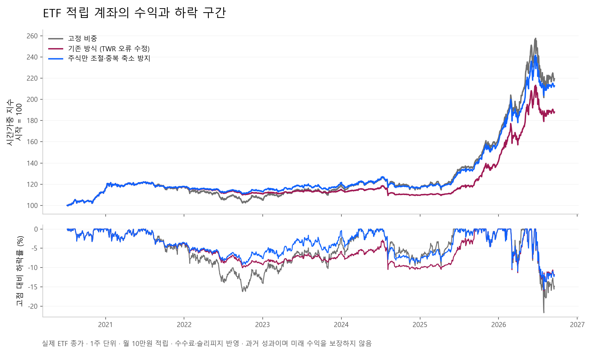

# 위험 관리 보완과 재검증

검증일 **2026-09-22** · 비교에 사용한 마지막 공통 종가 **2026-09-17**

같은 날 진행한 [주문 수량과 거래비용 점검](REBALANCE_REVIEW_20260922.md)에서는 추가 매수량, 현금 부족으로 인한 주문 보류, ETF 호가 계산을 고쳤습니다. 수정 전후 수익률과 낙폭도 함께 공개했습니다.

이번에는 위험 비중을 결정하는 자료와 계좌 구분을 보완하고 계산 시간을 줄였습니다. 9월 17일 정한 추세·낙폭 임계값과 자산 구성은 유지했습니다. 수익률을 높이려고 새 매매 조건을 반복 탐색한 결과가 아닙니다.

## 고친 문제

- **오래된 자료로 비중을 늘릴 수 있었습니다.** 지수와 계좌 기록의 마지막 날짜가 한국 거래일 기준 직전 거래일인지 확인합니다. 주말과 설정된 휴장일은 제외합니다. 오래되거나 날짜가 잘못된 자료는 위험 비중 확대의 근거로 쓰지 않고, 화면에 판단 보류 사유를 표시합니다.
- **손실 행을 삭제한 채 계산할 가능성을 막았습니다.** 날짜 오류·중복이 있으면 해당 입력 전체를 보류합니다. 당일·미래 기록은 신호 계산에서 제외합니다. 사용한 자료 날짜도 판단 기록에 남깁니다.
- **모의투자와 실전의 판단 기록을 분리했습니다.** 위험 관리 상태 파일을 `paper`·`live`별로 저장합니다. 이전 공용 파일은 모의투자만 이어받고, 잘못된 배수·상태는 읽지 않습니다.
- **날짜가 바뀌면 다시 판단합니다.** 동일 프로세스에서 전날 계산 결과가 다음 날까지 남지 않게 했습니다. 같은 날의 주문 계획과 실행은 같은 판단을 사용합니다.
- **연구 자료의 마지막 날짜를 맞춥니다.** 세 자료가 모두 있는 날까지만 비교합니다. 기간 중 누락은 이전 값으로 채우지 않고 검증을 중단합니다. 기준일을 바꾸면 결과 파일 이름도 해당 날짜로 바뀝니다.

거래일 판단은 프로젝트의 휴장일 설정에 의존합니다. 발표된 임시 휴장일이 설정에 빠지면 자료 확인을 보류할 수 있습니다. 손실 자체를 없애는 장치는 아니며, ETF 적립은 계속 모의투자 전용입니다.

## 9월 22일 자료 상태

| 자료 | 실제 제공된 마지막 날짜 | 비교에 사용한 마지막 날짜 | 뒤쪽에서 제외한 거래일 |
|---|---|---|---:|
| KODEX 200 `069500` | 9월 21일 | 9월 17일 | 2일 |
| TIGER CD금리 ETF `357870` | 9월 21일 | 9월 17일 | 2일 |
| 코스피200 `KS200` | 9월 17일 | 9월 17일 | 0일 |

조회한 날짜가 22일이라는 이유로 21일까지 검증됐다고 표시하지 않습니다. 자료별 날짜·사용 행 수·SHA-256은 [원본 결과](../reports/research/risk_review_20260922.json)에 있습니다.

## 같은 조건으로 다시 비교

2020-07-07~2026-09-17, 시작 30만원, 월 10만원 적립, 1주 단위, 최소 주문 5만원. 수수료·슬리피지 및 CD ETF 양의 매매차익에 대한 보수적 세금 근사를 포함합니다.

| 방식 | 연환산 수익률 | 최대 낙폭 | 샤프 | 비용 3배 연환산 수익률 |
|---|---:|---:|---:|---:|
| 고정 비중 | 13.53% | −21.72% | 0.79 | 13.41% |
| 기존 위험 관리 | 10.73% | −16.02% | 0.74 | 10.27% |
| 9월 17일 변경한 위험 관리 | 12.96% | −15.74% | 0.90 | 12.67% |



기존 방식도 적립금 계산 오류를 고친 상태로 비교했습니다. 변경한 규칙의 전체 기간 낙폭은 작았지만 고정 비중보다 수익률이 낮았습니다. 2023~2025년에는 기존 방식보다 최대 낙폭이 컸습니다(−8.80%, 기존 −7.86%). 이 비교는 이미 살펴본 자료로 하는 사후 검증이며 앞으로의 수익을 보장하지 않습니다. 분배금·실제 호가·괴리율·미체결은 재현하지 못했습니다. 자세한 가정은 [9월 17일 보고서](RISK_REVIEW_20260917.md)에 있습니다.

## 계산 속도

매일 pandas 행과 전체 과거 이력을 새로 만들던 부분을 바꿨습니다. 종가는 한 번 배열로 읽고, 추세 판단에는 필요한 이동평균 기간만 전달합니다.

Windows Python 3.12.10에서 기준 커밋 `9a7c145`와 비교했습니다. 같은 2026-09-17 가격 캐시를 사용한 **1,520거래일 결과 전체**를 매회 정확히 대조했고, 각 정책을 세 번씩 실행했습니다. 단위는 실행 시간의 중앙값입니다.

| 방식 | 수정 전 | 수정 후 | 속도 비율 |
|---|---:|---:|---:|
| 고정 비중 | 234ms | 54ms | 4.30배 |
| 기존 위험 관리 | 278ms | 90ms | 3.09배 |
| 변경한 위험 관리 | 271ms | 78ms | 3.45배 |

세 방식 모두 모든 날짜의 자산·현금·수량·수익률·낙폭·비용·위험 배수가 정확히 같았습니다. 이 속도 개선을 수익률 개선으로 표시하지 않습니다. [측정 원본](../reports/research/implementation_benchmark_20260922.json)과 [재현 스크립트](../tools/benchmark_risk_review.py)를 제공합니다.

## 확인한 자료와 적용 범위

- [AQR, Inflation Redux?, 2026-09-15](https://www.aqr.com/Insights/Research/Alternative-Thinking/Inflation-Redux): 인플레이션 불확실성, 주식·채권의 동반 손실과 구현 방식에 따른 차이를 다룹니다. 이를 국내 ETF의 특정 매수 시점이나 수익 보장 근거로 옮기지 않았습니다.
- [scikit-learn TimeSeriesSplit](https://scikit-learn.org/stable/modules/generated/sklearn.model_selection.TimeSeriesSplit.html): 시간 순서를 지켜 미래 자료가 과거 판단에 들어가지 않도록 하는 평가 원칙을 재확인했습니다. 새 모델이나 의존성을 추가하지 않았습니다.
- 자산 배분·비용·TWR 관련 기존 근거와 그 한계는 [9월 17일 조사 기록](RISK_REVIEW_20260917.md#2026년-자료를-어떻게-반영했나)에 정리했습니다.

## 재현

```powershell
.\.venv\Scripts\python.exe tools/risk_review.py --as-of 2026-09-22
.\.venv\Scripts\python.exe tools/benchmark_risk_review.py --baseline 9a7c145 --as-of 2026-09-17
.\.venv\Scripts\python.exe -m pytest tests/test_risk_review_data.py tests/test_basket_overlay_integration.py tests/test_risk_overlays.py tests/test_risk_overlay_backtest.py -q
```

데이터 공급자의 정정과 캐시 유무에 따라 재수집 값이 달라질 수 있으므로 결과 파일의 해시를 함께 확인합니다. 이 검증은 주문을 실행하지 않습니다.
