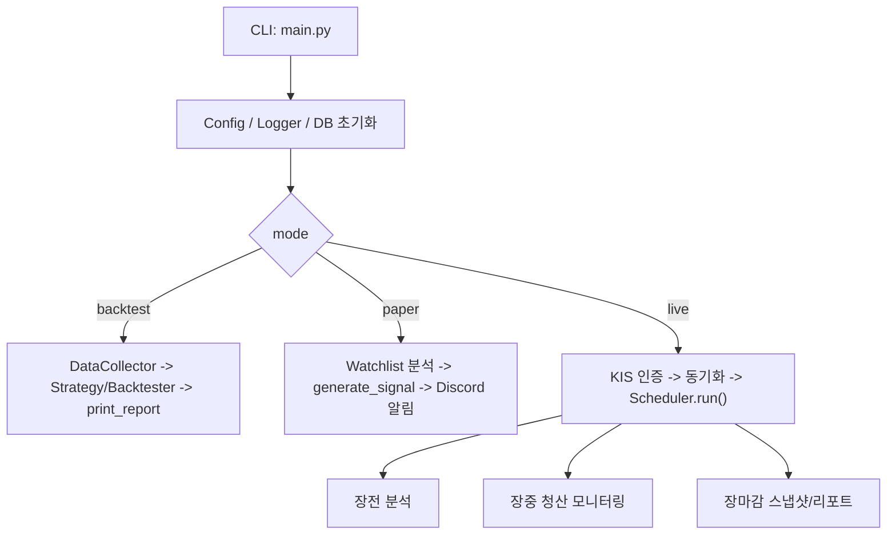
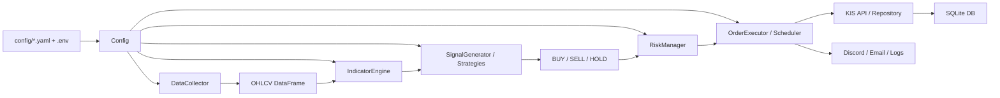

# QUANT TRADER 현재 프로젝트 정밀 구조·알고리즘 분석 보고서

작성일: 2026-03-17 (개선 작업 반영 갱신)  
분석 기준: 저장소 내 실제 코드, 설정 YAML, 테스트, 설계 문서(`quant_trader_design.md`)의 정적 분석  
분석 범위: 현재 저장소에 존재하는 코드만 포함, 외부 서비스 실시간 상태 및 네트워크 연동은 검증하지 않음

---

## 1. 프로젝트 개요

이 프로젝트는 Python 기반의 국내 주식 자동매매 실험 시스템이다. 전체 구조는 `main.py`를 중심으로 백테스트, 페이퍼 트레이딩, 실전 트레이딩 3개 모드를 분기하고, 설정은 YAML과 환경변수로 관리하며, 데이터는 KIS API·FinanceDataReader·yfinance에서 수집하도록 설계되어 있다.

핵심 의도는 다음과 같다.

- 기술적 지표 기반 신호 생성
- 전략별 진입/청산 판단
- 리스크 관리 규칙 적용
- KIS API를 통한 시세 조회·주문·잔고 조회
- SQLite 기반 상태 저장
- 디스코드/이메일 알림 및 장중 운영 보조

개선 작업 반영 후, 백테스트·지표/리스크 계층에 더해 paper/live 신규 진입 흐름(OrderExecutor·auto_entry·장전 후보)과 전략 인터페이스 통일·리포트 CLI·DailyReport·테스트 재현성이 갖춰져 있다. 백테스트 시뮬레이션에는 ATR 손절·1% 룰·부분 익절·트레일링 스탑이 반영되어 있다.

### 1.1 실행 모드

| 모드 | 진입 인자 | 실제 역할 | 현재 상태 |
|---|---|---|---|
| `backtest` | `python main.py --mode backtest` | 과거 OHLCV 데이터 기반 전략 성능 검증 | 4개 전략 지원, ReportGenerator CLI 연결, `--output-dir` 지원 |
| `paper` | `python main.py --mode paper` | 관심 종목 분석 + BUY/SELL 시 OrderExecutor(DB·알림) 호출 | 모의 주문 흐름 연결됨 |
| `live` | `python main.py --mode live --confirm-live` | KIS 인증 후 스케줄러 실행, `trading.auto_entry: true` 시 장전 BUY 후보 → 장중 execute_buy | 신규 진입 자동화 연결됨(기본 auto_entry: false) |

### 1.2 지원 시장 범위

- 국내 주식: 주력 지원 대상
- 미국 주식: `DataCollector.fetch_us_stock()` 수준의 데이터 수집만 부분 지원
- 실시간/주문 연동: KIS API 전제이므로 사실상 국내 주식 중심

### 1.3 주요 의존성

| 범주 | 사용 라이브러리 |
|---|---|
| 데이터 처리 | `pandas`, `numpy`, `scipy` |
| 지표 계산 | `pandas-ta`(선택), 내장 폴백 수식 |
| 데이터 수집 | `FinanceDataReader`, `yfinance`, `pykrx` |
| 네트워크 | `requests`, `websockets`, `aiohttp` |
| DB | `sqlalchemy` |
| 설정 | `pyyaml`, `python-dotenv` |
| 로깅/테스트 | `loguru`, `pytest`, `pytest-asyncio` |

### 1.4 현재 런타임 제약

- **개선 후**: `.venv` 재생성 및 `pip install -r requirements.txt` 완료 시 Python 3.11/3.12 환경에서 `pytest tests/` 통과, `python main.py --mode backtest --strategy scoring --symbol 005930` 실행 가능. KIS/WebSocket 모의 E2E 테스트 포함.
- `pyproject.toml`(>=3.11,<3.13), `README.md`, `requirements.txt`의 Python 버전 정책은 통일되어 있음.
- pandas-ta는 `>=0.4.67b0` 사용(미설치 시 `core/indicator_engine.py` 내장 폴백).

---

## 2. 시스템 아키텍처

### 2.1 최상위 실행 흐름

`main.py`는 아래 순서로 시스템을 초기화한다.

1. `setup_logger()` 호출
2. `init_database()` 호출
3. CLI 인자 파싱 결과에 따라 `run_backtest()` / `run_paper_trading()` / `run_live_trading()` 분기

### 2.2 모듈 간 데이터 흐름

### 2.3 계층별 책임 요약

| 계층 | 주요 파일 | 책임 |
|---|---|---|
| 진입/조합 | `main.py` | 모드 선택, 시스템 초기화, 라이프사이클 제어 |
| 설정 | `config/config_loader.py`, `config/*.yaml` | YAML 로드, 환경변수 우선 적용, 싱글톤 제공 |
| 데이터 수집 | `core/data_collector.py`, `api/kis_api.py`, `api/websocket_handler.py` | OHLCV 수집, 현재가 조회, 실시간 스트림 |
| 분석/신호 | `core/indicator_engine.py`, `core/signal_generator.py`, `strategies/*` | 지표 계산, 전략 판단, 앙상블 통합 |
| 리스크/주문 | `core/risk_manager.py`, `core/order_executor.py` | 수량 계산, 손절/익절, 비용 계산, 주문 실행 |
| 운영 제어 | `core/scheduler.py`, `core/trading_hours.py`, `core/blackswan_detector.py` | 장전/장중/장마감 사이클, 시간 제어, 급락 대응 |
| 상태 저장 | `database/models.py`, `database/repositories.py` | 주가/거래/포지션/스냅샷 저장 |
| 모니터링 | `monitoring/logger.py`, `monitoring/discord_bot.py`, `core/notifier.py`, `monitoring/dashboard.py` | 로그, 디스코드, 이메일 fallback, 콘솔 대시보드 |
| 검증 | `tests/*`, `test_integration.py` | 단위 테스트, 통합 스모크 성격의 점검 스크립트 |

---

## 3. 설정 구조와 인터페이스

### 3.1 설정 로딩 방식

`Config`는 싱글톤이며, 내부적으로 다음 파일을 읽는다.

- `config/settings.yaml`
- `config/strategies.yaml`
- `config/risk_params.yaml`

환경변수 우선 규칙은 다음과 같다.

- `KIS_APP_KEY`, `KIS_APP_SECRET`, `KIS_ACCOUNT_NO`
- `DISCORD_WEBHOOK_URL`
- `MAX_CALLS_PER_SEC`, `MAX_RETRY`

중요한 특징은 KIS API 키/시크릿은 YAML 값이 있더라도 환경변수로 덮어쓴다는 점이다. 즉, 샘플 `settings.yaml`에 값이 있어도 실제 실행에는 `.env` 또는 시스템 환경변수 세팅이 필요하다.

### 3.2 CLI 공개 인터페이스

| 인자 | 의미 |
|---|---|
| `--mode` | `backtest`, `paper`, `live` |
| `--strategy` | `scoring`, `mean_reversion`, `trend_following`, `ensemble` |
| `--symbol` | 백테스트용 종목 코드 |
| `--start`, `--end` | 백테스트 기간 |
| `--strict-lookahead` | 시점별 슬라이싱으로 미래 데이터 참조 차단 |
| `--confirm-live` | 실전 모드 안전 확인 플래그 |

### 3.3 전략 공통 인터페이스

`strategies/base_strategy.py`는 아래 계약을 강제한다.

- `analyze(df) -> pd.DataFrame`
- `generate_signal(df) -> dict`

하지만 실제 상위 시스템은 전략 구현체마다 서로 다른 기대를 가진다.

- `run_paper_trading()`과 `Scheduler._run_pre_market()`은 `generate_signal()` 중심
- `Backtester.run()`은 사실상 `analyze()` 결과 안에 `signal` 컬럼이 있기를 기대

이 차이 때문에 전략별 백테스트 지원이 비대칭적으로 된다.

---

## 4. 계층별 상세 분석

### 4.1 `config/`

- `config_loader.py`는 설정 로딩의 단일 진입점이다.
- `.env`가 존재하면 `dotenv`로 자동 로드한다.
- `Config.watchlist`는 `settings.yaml`의 `watchlist.symbols`를 리스트로 변환한다.
- 지표 파라미터는 `Config.indicators`, 전략 파라미터는 `Config.strategies`, 리스크는 `Config.risk_params`로 나뉜다.

구조는 단순하고 명확하지만, “현재 실제 사용되는 설정”과 “파일에만 존재하는 설정”이 섞여 있다.

예시:

- 실제 사용: `rsi.period`, `scoring.weights`, `transaction_costs.slippage_ticks`
- 부분 사용: `trailing_stop.type`, `take_profit.partial_exit`
- 미사용 또는 거의 미사용: `diversification.max_sector_ratio`, `diversification.min_cash_ratio`, `drawdown.recovery_scale`

### 4.2 `api/`

#### `KISApi`

주요 역할:

- OAuth 토큰 발급
- 현재가 조회
- 일봉 조회
- 매수/매도 주문
- 잔고 조회

보호 로직:

- Token Bucket Rate Limiter
- 429/50x 재시도
- 401 재인증
- Circuit Breaker 연동

핵심 메서드:

- `authenticate()`
- `get_current_price(symbol)`
- `get_daily_prices(symbol, period, count)`
- `buy_order(symbol, quantity, price, order_type)`
- `sell_order(...)`
- `get_balance()`

#### `WebSocketHandler`

- asyncio 기반 무한 재연결 루프
- 수신 루프와 heartbeat 루프를 분리
- 수신 데이터는 `core.data_validator.DataValidator`로 정합성 검증 후 콜백 전달

구현상 특징:

- `PING`/`PONG` 처리와 `ping()` 호출 둘 다 포함
- “데이터가 45초 이상 없으면 연결 재생성” 정책 사용
- **개선 후**: `connect()` 시 `KISApi.get_approval_key()`로 웹소켓 전용 승인키 발급 후 구독 메시지에 사용. 연결/승인키(마스킹)/첫 실시간 데이터 수신 로깅으로 실환경 추적 가능.

#### `CircuitBreaker`

- 상태: `CLOSED -> OPEN -> HALF_OPEN`
- 연속 실패 5회 기본값
- 복구 대기 60초 기본값
- 발동 시 디스코드 알림 전송 시도

### 4.3 `core/`

#### `DataCollector`

수집 우선순위:

1. 한국 주식: `FinanceDataReader`
2. 실패 시 `yfinance` (`005930.KS`)
3. 둘 다 안 되면 KIS 일봉 폴백

특징:

- 컬럼 정규화(`open`, `high`, `low`, `close`, `volume`)
- `DataValidator.clean_dataframe()` 적용
- DB 캐시 조회/저장 가능

한계:

- 실시간 수집은 별도 WebSocket 계층에 있고, `Scheduler`는 신규 진입에 이를 적극 활용하지 않는다.

#### `IndicatorEngine`

지표 계산 전용 엔진이다. `pandas-ta`가 있으면 라이브러리 기반 계산, 없으면 내장 수식으로 폴백한다.

계산 지표:

- RSI
- MACD
- Bollinger Bands
- SMA/EMA
- Stochastic
- ADX
- ATR
- OBV
- 거래량 비율

데이터가 30행 미만이면 경고 후 원본 반환한다.

#### `SignalGenerator`

스코어링 전략 전용 신호 생성기로 볼 수 있다.

- RSI, MACD, 볼린저, 거래량, 이동평균 5개 점수 합산
- 필수 YAML 가중치 누락 시 `KeyError`
- 최종 `signal`은 `BUY`, `SELL`, `HOLD`

특징:

- MACD 히스토그램 방향에 `+0.5`, `-0.5`의 약한 보너스/페널티를 준다.
- MA 크로스는 `sma_5`/`ema_5`, `sma_20`/`ema_20` 탐색 방식이다.

#### `RiskManager`

주요 역할:

- 1% 룰 기반 포지션 사이징
- ATR 또는 고정 비율 손절/익절/트레일링 계산
- MDD 및 일일 손실 체크
- 분산 투자 체크
- 거래 비용 계산

특징:

- KRX 호가 단위를 `_get_tick_size()`로 계산한다.
- 슬리피지는 `max(비율 슬리피지, tick_size * N틱)`로 계산한다.
- 손절폭이 지나치게 작으면 수량 계산을 0으로 막는다.

구현상 공백:

- `check_diversification()`에서 `min_cash_ratio`, `max_sector_ratio`는 실제로 사용되지 않는다.
- `recovery_scale`은 선언돼 있지만 운영 로직에서 적용되지 않는다.

#### `OrderExecutor`

주요 흐름:

1. `PositionLock` 획득
2. 손절가/수량/분산 체크/비용 계산
3. 사전 안전 체크(실전에서만 거래시간·블랙스완 체크)
4. live면 KIS 주문, paper면 DB 기록만
5. 거래 내역과 포지션 저장

특징:

- live에서만 실제 주문, paper는 시뮬레이션 저장 구조
- 주문 재시도는 1초, 2초, 4초 지수 백오프
- 청산 체크는 손절/트레일링/익절 순서

중요한 사실:

- `run_paper_trading()`는 이 `OrderExecutor`를 호출하지 않는다.
- 즉 “paper 모드”는 주문 시뮬레이터가 아니라 분석 + 알림 실행기다.

#### `Scheduler`

일중 운영은 다음 3단계다.

1. 장전 준비: 관심 종목 신호 분석, 신호 알림
2. 장중 모니터링: 기존 포지션 청산 조건 체크
3. 장마감: 스냅샷 저장, 일일 리포트 전송

가장 중요한 제한:

- 장중 신규 매수/매도 진입 로직이 없다.
- 장전 분석에서도 `generate_signal()` 결과를 알림으로만 보내고 주문을 넣지 않는다.
- 결과적으로 live 스케줄러는 “기존 포지션 청산 관리” 쪽에 가깝다.

#### `TradingHours`

공휴일 로드 우선순위:

1. `config/holidays.yaml`
2. `pykrx` 동적 계산
3. 코드 내 fallback 집합

거래일/장중/장전/남은 시간 계산을 담당한다.

#### `BlackSwanDetector`

감지 기준:

- 개별 종목 -5% 급락
- 포트폴리오 -3% 급락
- 3일 연속 -2% 이상 하락

발동 시:

- 쿨다운 활성화
- 반복 발동 시 쿨다운 최대 4시간까지 증가

#### `PortfolioManager`

역할:

- 포트폴리오 요약
- 스냅샷 저장
- live 모드에서 KIS 총자산 조회
- DB와 KIS 포지션 비교

한계:

- paper 모드에서는 현재 보유 포지션만 보고 `initial_capital - invested` 방식으로 현금을 계산한다.
- 따라서 과거 매도에 따른 실현 손익이 현금에 반영되지 않는다.
- 즉 paper 성과 추적은 정확한 잔고 시스템이 아니라 단순 추정치다.

### 4.4 `strategies/`

#### 구현된 전략

| 전략 | 판단 기준 | 출력 방식 | 현재 사용 가능성 |
|---|---|---|---|
| `ScoringStrategy` | 지표 점수 합산 | `analyze()`가 지표+신호 생성 | 가장 완성도 높음 |
| `MeanReversionStrategy` | Z-Score, ADX, RSI, 거래량 급변 필터 | `generate_signal()`만 완성 | 백테스트 직접 호환성 낮음 |
| `TrendFollowingStrategy` | ADX, 200일선, MACD 크로스 | `generate_signal()`만 완성 | 백테스트 직접 호환성 낮음 |
| `StrategyEnsemble` | 다수결/가중합/보수적 합성 | `generate_signal()` 중심 | 백테스트 비호환에 가까움 |

#### 전략별 상세

`ScoringStrategy`

- `IndicatorEngine.calculate_all()`
- `SignalGenerator.generate()`
- 최신 행을 딕셔너리로 반환

`MeanReversionStrategy`

- `lookback_period` 기반 rolling mean/std로 `z_score` 계산
- ADX가 낮을 때만 진입 허용
- RSI로 재확인
- 거래량 급변 시 매수 차단

`TrendFollowingStrategy`

- ADX 강도
- 200일선 위/아래
- MACD 골든/데드 크로스
- 세 조건 충족 시 매수, 일부 반전 조건 시 매도

`StrategyEnsemble`

- 모든 전략의 `generate_signal()` 호출
- 모드별 최종 신호 결정
  - `majority_vote`
  - `weighted_sum`
  - `conservative`

구조적 문제:

- `analyze()`는 첫 번째 전략의 분석 결과만 반환한다.
- 따라서 백테스트 엔진과 연결될 때 앙상블 고유 신호가 `DataFrame`으로 생성되지 않는다.

### 4.5 `backtest/`

#### `Backtester`

백테스트 흐름:

1. 전략 선택
2. `strict_lookahead` 여부에 따라 분석
3. `_simulate()`로 거래 시뮬레이션
4. `_calculate_metrics()`로 KPI 산출

성과 지표:

- 총 수익률
- 연간 수익률
- 샤프 비율
- 최대 낙폭
- 승률
- 손익비
- 칼마 비율

시뮬레이션 규칙 (개선 후):

- 현금 시작값은 `initial_capital`
- 매수 수량: 1% 룰(`max_risk_per_trade`)과 `max_position_ratio` 중 작은 값
- 손절: 고정 비율 또는 ATR 배수(`stop_loss.type`/`atr_multiplier`)
- 익절: 고정 비율, 선택적 부분 익절(`partial_exit`/`partial_target`/`partial_ratio`)
- 트레일링 스탑: `trailing_stop.enabled` 시 고점 대비 고정/ATR 청산, `TRAILING_STOP` 거래 기록
- 슬리피지·수수료·세금 적용

핵심 한계:

- 백테스터는 사실상 `analyze()` 결과에 `signal` 컬럼이 들어있기를 기대한다.
- 이 조건을 만족하는 건 현재 `ScoringStrategy`뿐이다.
- `mean_reversion`, `trend_following`, `ensemble`는 CLI에 노출되어 있지만 비엄격 모드 백테스트에서는 실패 가능성이 높다.
- `strict_lookahead=True`에서도 비스코어링 전략은 `signal` 컬럼이 없어 사실상 `HOLD`로 흘러갈 가능성이 높다.

#### `ReportGenerator`

- 텍스트 리포트
- HTML 리포트
- 간단한 SVG 자본곡선

상태:

- **개선 후**: `run_backtest()` 마지막에서 `ReportGenerator.generate_all()` 호출로 txt/HTML 리포트 자동 저장. `--output-dir`로 저장 경로 지정 가능.

### 4.6 `database/`

#### ORM 모델

| 모델 | 역할 | 사용 현황 |
|---|---|---|
| `StockPrice` | 종목별 OHLCV 저장 | 사용 중 |
| `TradeHistory` | 매매 실행 기록 | 사용 중 |
| `Position` | 현재 포지션 | 사용 중 |
| `PortfolioSnapshot` | 일별 포트폴리오 상태 | 사용 중 |
| `DailyReport` | 일일 리포트 저장 | 사용 중 (`save_daily_report`, `get_daily_reports`, 스케줄러 장마감 연동) |

#### Repository 계층 특징

- 주가 저장은 `(symbol, date)` 중복을 확인 후 저장
- 포지션은 추가 매수 시 평균단가 재계산
- 부분 매도는 `reduce_position()`
- 트레일링 스탑 업데이트는 `update_trailing_stop()`

- **개선 후**: `save_daily_report()`, `get_daily_reports()` 구현됨. `Scheduler._run_post_market()`에서 일일 리포트 DB 저장 후 Discord 발송.

### 4.7 `monitoring/` 및 알림

#### `DiscordBot`

- 웹훅 기반 메시지/임베드/거래 알림/일일 리포트/신호 알림 지원
- 비활성화 시 콘솔 출력 fallback

- **개선 후**: 비활성화(콘솔 fallback) 시 `send_message()`/`send_embed()` 모두 **True** 반환으로 통일.

#### `Notifier`

- 위치는 `core/notifier.py`
- 디스코드 실패 시 이메일 fallback
- critical 이벤트는 양쪽 모두 발송 시도

- **개선 후**: `sync_with_broker()` 내부 import는 `from core.notifier import Notifier`로 수정되어 있음.

#### `Dashboard`

- 콘솔 기반 대시보드
- 웹 대시보드가 아니라 터미널 출력용
- 현재 잔고 계산은 `PortfolioManager`와 동일한 단순 추정 방식

### 4.8 `tests/`

현재 테스트는 아래 범위에 집중되어 있다.

| 테스트 파일 | 검증 내용 | 깊이 |
|---|---|---|
| `test_signal_generator.py` | 가중치 필수 여부 | 단위 테스트 |
| `test_risk_manager.py` | 포지션 사이징 엣지 케이스, 호가 단위 | 단위 테스트 |
| `test_trading_hours.py` | 주말/장중 판별 | 단위 테스트 |
| `test_blackswan_detector.py` | 기본 감지기 동작 | 단위 테스트 |
| `test_order_executor_paper.py` | import 및 lock smoke test | 스모크 테스트 |
| `test_integration.py` | 설정/DB/지표/전략/리포트/알림/대시보드/KIS 초기화 점검 | 통합 스모크 성격 |
| `test_integration_smoke.py` | 동일 검증을 pytest 수집 가능한 클래스/함수로 분리 | 통합 스모크 |
| `test_backtester_strategies.py` | 4개 전략 `analyze()` 계약, Backtester 전략별 실행 | 단위/통합 |
| `test_portfolio_manager.py` | 포트폴리오 요약·sync_with_broker Notifier 경로 | 단위 |
| `test_discord_bot.py` | 비활성화 시 True 반환 | 단위 |

**개선 후**: `.venv` 재생성 시 `pytest tests/` 통과. Backtester 4전략·통합 스모크·Scheduler 장전/장중/장마감·KIS/WebSocket 모의 E2E 포함. 미검증: KIS 실거래 호출, WebSocket 실시간 수신.

---

## 5. 알고리즘 상세

### 5.1 기술 지표 계산 방식

| 지표 | 계산 방식 | 폴백 구현 여부 |
|---|---|---|
| RSI | `pandas_ta.rsi()` 또는 Wilder smoothing 수동 계산 | 있음 |
| MACD | `pandas_ta.macd()` 또는 EMA 차이 계산 | 있음 |
| 볼린저 밴드 | `pandas_ta.bbands()` 또는 rolling mean/std | 있음 |
| 이동평균 | rolling mean + EWM | 내장 |
| Stochastic | `pandas_ta.stoch()` 또는 rolling high/low | 있음 |
| ADX | `pandas_ta.adx()` 또는 간략 수동 계산 | 있음 |
| ATR | `pandas_ta.atr()` 또는 True Range rolling mean | 있음 |
| OBV | `pandas_ta.obv()` 또는 누적 합산 | 있음 |
| 거래량 비율 | `volume / rolling(volume_avg)` | 내장 |

### 5.2 스코어링 전략 의사결정

합산 대상:

- RSI 과매수/과매도
- MACD 골든/데드 크로스
- 볼린저 상하단 이탈
- 거래량 급증 + 가격 방향
- 단기/중기 이동평균 크로스

기본 임계값:

- `buy_threshold = 5`
- `sell_threshold = -4`

세부 특징:

- MACD 히스토그램 상승/하락에 약한 보너스
- 필수 가중치가 빠지면 조용히 기본값을 쓰지 않고 오류를 발생시켜 설정 누락을 드러냄

### 5.3 평균 회귀 전략

수식:

- `z_mean = rolling_mean(close, lookback)`
- `z_std = rolling_std(close, lookback)`
- `z_score = (close - z_mean) / z_std`

진입 논리:

- ADX < 필터값
- `z_score <= z_score_buy`
- RSI < 40이면 매수

청산 논리:

- `z_score >= z_score_sell`
- RSI > 60이면 매도

추가 방어:

- 평균 대비 거래량이 `volume_spike_filter` 초과 시 매수 차단

### 5.4 추세 추종 전략

매수 조건:

- ADX > `adx_threshold`
- 종가 > 200일선
- MACD 골든크로스

매도 조건:

- MACD 데드크로스
- 또는 강한 추세 상태에서 종가 < 200일선

### 5.5 앙상블 전략

지원 모드:

- 다수결
- 가중합
- 보수적 일치

수치 매핑:

- `BUY = 1`
- `HOLD = 0`
- `SELL = -1`

### 5.6 리스크 관리 수식

#### 포지션 사이징

- 최대 허용 손실 = `capital * max_risk_per_trade`
- 주당 손실 = `abs(entry_price - stop_loss_price)`
- 수량 = `int(max_loss / risk_per_share)`
- 최종 수량 = 종목 비중 제한과 비교한 최소값

#### 손절/익절/트레일링

- 손절: 고정 비율 또는 `entry - atr * multiplier`
- 익절: 고정 최종 목표가 + 선택적 1차 부분 익절 목표가
- 트레일링: 고정 비율 또는 `highest - atr * multiplier`

#### 거래 비용

- 수수료 = `price * quantity * commission_rate`
- 세금 = 매도 시 `price * quantity * tax_rate`
- 슬리피지 = `max(price * slippage_rate, tick_size * slippage_ticks) * quantity`

### 5.7 백테스트 시뮬레이션 규칙 (개선 후)

`risk_params.yaml`의 손절/익절/트레일링/포지션 사이징을 반영한다.

- 진입: 1% 룰·`max_position_ratio`로 매수 수량 결정
- 손절: 고정 비율 또는 ATR 배수
- 익절: 고정 비율 + 선택적 1차 부분 익절
- 트레일링 스탑: `trailing_stop.enabled` 시 고점 대비 고정/ATR 청산
- 종목 1개 가정, 포지션 동시 1개
- 승률/손익비 등 집계 시 `STOP_LOSS`, `TAKE_PROFIT`, `TAKE_PROFIT_PARTIAL`, `TRAILING_STOP`, `SELL` 모두 매도 거래로 포함

---

## 6. 운영 로직 상세

### 6.1 거래시간 판별

- 장전 준비: `08:50 ~ 09:00`
- 장중: `09:00 ~ 15:30`
- 장마감 처리: `15:35 이후`

### 6.2 공휴일 로드 우선순위

1. `config/holidays.yaml`
2. `pykrx` 거래일 역산
3. 코드 내 fallback 집합

### 6.3 블랙스완 쿨다운

- 종목 급락/포트폴리오 급락/연속 하락 시 쿨다운
- 반복 발동 시 쿨다운 증가
- 스케줄러는 쿨다운 중 신규 매수만 스킵하고, 청산은 유지하려는 의도를 가진다

### 6.4 동시성 방어

- `PositionLock`은 `threading.RLock`
- `OrderExecutor`와 `Scheduler` 청산 루틴이 공유 자원 접근 시 락 사용

### 6.5 포트폴리오 동기화

- live 모드 시작 시 `PortfolioManager.sync_with_broker()` 호출
- KIS 포지션과 DB 포지션을 비교
- 불일치 시 경고와 알림을 보내려 하지만, 앞서 언급한 import 경로 버그 때문에 알림은 실패 가능성이 높다

---

## 7. 구현 완료도 분류

### 7.1 구현 상태 표

| 항목 | 상태 | 근거 |
|---|---|---|
| YAML 기반 설정 로딩 | 실행 가능 | `Config`, 환경변수 override 구현 |
| KIS REST 인증/조회/주문 래퍼 | 조건부 실행 | 코드 존재, 실환경 자격증명 필요 |
| 국내 OHLCV 수집 | 조건부 실행 | FDR/yfinance/KIS 폴백 구조 존재 |
| 지표 계산 엔진 | 실행 가능 | 내장 폴백 수식 포함 |
| 스코어링 전략 신호 생성 | 실행 가능 | `analyze()`와 `generate_signal()` 모두 연결 |
| 평균회귀/추세추종 신호 생성 | 실행 가능 | `analyze()`가 `signal` 컬럼 반환, 백테스트 4전략 지원 |
| 앙상블 신호 통합 | 실행 가능 | 하위 전략 신호 합성 후 `signal` 컬럼, 백테스트 지원 |
| 백테스트 콘솔 출력 | 실행 가능 | 4개 전략 오류 없이 완료 |
| 리포트 파일 생성기 | 실행 가능 | CLI 연결됨, `--output-dir` 지원 |
| paper 모드 자동 모의주문 | 실행 가능 | BUY/SELL 시 OrderExecutor 호출, DB·알림 기록 |
| live 모드 신규 진입 자동화 | 조건부 실행 | `auto_entry: true` 시 장전 후보 → 장중 execute_buy (기본 false) |
| 블랙스완 쿨다운 | 실행 가능 | 감지 및 상태 관리 구현 |
| 일일 포트폴리오 스냅샷 | 실행 가능 | 저장 로직 구현 |
| DailyReport DB 저장 | 실행 가능 | save_daily_report, get_daily_reports, 장마감 연동 |
| 웹 대시보드/Grafana | 문서상 계획 | 콘솔 대시보드만 존재 |
| 실행 기반 테스트 검증 | 실행 가능 | .venv 재생성 후 pytest 통과 (KIS/WS 모의 E2E 포함) |

### 7.2 설계 문서 대비 차이 표

| 설계 문서 서술 | 현재 코드 현실 |
|---|---|
| “자동 주식 매매 시스템” | paper/live 신규 진입 흐름 연결됨(paper 즉시, live는 auto_entry 시). 청산·스케줄·리포트 연동 완료 |
| “백테스팅 & 리포트 자동 생성” | 백테스트 + ReportGenerator CLI 연결, 4전략 지원 |
| “페이퍼 트레이딩” | BUY/SELL 시 OrderExecutor 호출, DB·알림·포트폴리오 반영 |
| “추세추종/평균회귀 전략 지원” | 4개 전략 analyze() signal 컬럼 규약 통일, 백테스트 정상 동작 |
| “일일 리포트 저장/관리” | DailyReport CRUD 및 장마감 시 DB 저장·디스코드 발송 |
| “웹/실시간 모니터링 확장성” | 콘솔 대시보드와 디스코드 중심, GUI는 없음 |

---

## 8. 차이점 및 리스크

### 8.1 구조적 차이 (개선 후 반영)

1. **전략·백테스터**: `analyze()` 반환 계약(signal 컬럼) 통일됨. 4개 전략 모두 백테스트 경로에서 정상 동작.
2. **실전 스케줄러**: `auto_entry: true` 시 장전 BUY 후보 수집 → 장중 `_execute_entry_candidates()`로 OrderExecutor.execute_buy 호출. 기본값은 false로 신규 진입 비활성.
3. **paper 모드**: BUY/SELL 시 OrderExecutor 호출로 DB·알림·포트폴리오 반영.
4. **백테스트 엔진**: 운영 리스크 규칙 반영 — ATR/고정 손절, 고정/부분 익절, 1% 룰 포지션 사이징, 트레일링 스탑(고점 대비 고정/ATR) 시뮬레이션 지원.

### 8.2 잠재적 버그 또는 위험 지점 (개선 후)

- **해소됨**: Notifier import(`core.notifier`), DiscordBot 반환값 통일, live 신규 진입 경로(auto_entry), 백테스트 4전략 지원, .venv 재생성 가능.
- **잔여 리스크**: live 첫 활성화 시 실주문 가능성 → auto_entry 기본 false, 소액 검증 권장. 백테스트와 운영 리스크 규칙 불일치로 인한 성과 편차 가능성.

### 8.3 문서/환경 불일치

- **개선 후**: README·requirements·pyproject.toml의 Python 버전 정책(3.11~3.12, >=3.11,<3.13) 통일됨.

---

## 9. 테스트 및 품질 현황

### 9.1 현재 테스트가 보장하는 것

- 설정 누락 시 명시적 예외가 나는지
- 포지션 사이징 기본 엣지 케이스가 방어되는지
- 거래시간/공휴일 판단 기초 로직
- 블랙스완 감지기의 기본 허용 상태
- 일부 모듈 import 스모크 확인

### 9.2 현재 테스트가 보장하지 못하는 것

- 실거래 API 통신 성공 여부 (단, live 진입 시 `verify_connection()` 및 로깅으로 실환경 디버깅 용이)
- 스케줄러 하루 루틴 E2E(장전→장중→장마감) 실제 실행
- WebSocket 수신/재연결 실환경 검증 (연결·승인키·첫 데이터 수신 로깅으로 추적 가능)

### 9.3 검증 한계

- **개선 후**: `.venv` 재생성 및 의존성 설치 시 `pytest tests/` 실행 가능. 백테스트·paper 진입·KIS/WebSocket 모의 E2E 검증 가능.
- 보고서 초안 작성 시점에는 venv 경로 손상으로 실행 검증이 제외되었으며, 그 사실은 당시 “검증 한계”에 기재됨.

---

## 10. 결론

현재 프로젝트는 다음 세 가지 강점이 있다.

1. 지표 계산, 스코어링, 리스크 계산, API 보호 로직이 비교적 명확하게 분리돼 있다.
2. KIS REST 연동, WebSocket 복구, 블랙스완/거래시간 제어 등 실전 운영을 고려한 보호 장치가 이미 들어가 있다.
3. 설정 외부화와 저장소 구조가 정돈되어 있어, 후속 확장이 가능한 기반은 갖춰져 있다.

개선 작업 반영 후 상태를 한 문장으로 요약하면 다음과 같다.

> “백테스트·paper·live 진입 흐름과 전략 인터페이스가 연결된 상태이며, 백테스트 시뮬레이션에 ATR 손절·1% 룰·부분 익절·트레일링 스탑이 반영되어 있다. 실행 환경 복구 시 pytest·백테스트·리포트 생성이 동작한다.”

### 10.1 현재 성숙도 판단 (개선 후)

- 분석 엔진: 중상
- 전략 다양성: 중상 (4전략·앙상블, 백테스트 호환)
- 리스크 관리 함수: 중상 (recovery_scale 적용, max_sector_ratio 미구현 명시)
- 백테스트 완성도: 중 (4전략·리포트 CLI 연결)
- 실전 자동화 완성도: 중 (auto_entry·장전 후보·장중 실행 연결, 기본 비활성)
- 실행 재현성: 중 (.venv 재생성 시 테스트·백테스트 실행 가능)

### 10.2 다음 우선순위 제안

1. ~~백테스트 시뮬레이션에 ATR 손절·부분 익절·1% 룰 반영 검토~~ (반영 완료)
2. ~~Scheduler E2E 또는 장전/장중/장마감 시뮬레이션 테스트 추가~~ (반영 완료)
3. ~~KIS 실환경·WebSocket 연결 검증 및 로깅 보강~~ (반영 완료)
4. ~~백테스트 트레일링 스탑 반영~~ (반영 완료)
5. ~~KIS 실거래/WebSocket E2E 자동 테스트(모의 환경)~~ (반영 완료: `tests/test_kis_websocket_e2e.py` — KIS 인증/approval_key/verify_connection·WebSocket 연결/연결거부/ disconnect 플로우 모킹 검증)

---

## 부록 A. 핵심 공개 인터페이스 정리

### A.1 전략 인터페이스

- `BaseStrategy.analyze(df) -> pd.DataFrame`
- `BaseStrategy.generate_signal(df) -> dict`

### A.2 KIS API 래퍼 인터페이스

- `authenticate() -> bool`
- `verify_connection() -> bool` — 토큰 발급 후 잔고 조회 1회로 실환경 연결 검증(로깅)
- `get_approval_key() -> str` — 웹소켓 구독용 승인키 발급
- `get_current_price(symbol) -> dict | None`
- `get_daily_prices(symbol, period, count) -> list | None`
- `buy_order(...) -> dict | None`
- `sell_order(...) -> dict | None`
- `get_balance() -> dict | None`

### A.3 Repository 주요 함수군

- 시세: `save_stock_prices()`, `get_stock_prices()`
- 거래: `save_trade()`, `get_trade_history()`
- 포지션: `save_position()`, `get_position()`, `get_all_positions()`, `reduce_position()`, `delete_position()`
- 스냅샷: `save_portfolio_snapshot()`, `get_portfolio_snapshots()`

---

## 부록 B. 한 줄 총평

개선 작업 반영 후, 전략·백테스트·paper/live 진입 계층이 연결되어 있고 실행 환경만 갖추면 테스트·백테스트·리포트 생성이 동작한다. 완전 자동매매를 위해서는 백테스트와 운영 리스크 규칙의 정합성 강화 및 실환경 검증이 남은 과제이다.
